# Алгоритмы и структуры данных


## 1. Оценка сложности алгоритма по времени
**Оценка сложности *по времени*** - сколько операций выполняет программа в зависимости от **количества принимаемых данных**.

- 1 операция — 1 пункт сложности.
- 1 итерация = $k$ операций в итерации — $k$ пунктов сложности.
- Условие = $k$ логических операций и действий — $k$ пунктов сложности.

**T(n)** — функция, описывающая сложность алгоритма *в зависимости **от количества** принимаемых данных*. <br/>
Алгоритмы классифицируют в соответствии с их **временной сложностью**. <br/>
**Точная** оценка алгоритма, тогда и только тогда, когда, верхняя граница $O(n)$ и нижняя граница $\Omega (n)$ ***совпадают***. <br/>

| | |
|-|-|
| 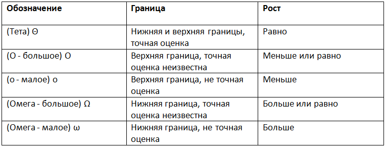 | 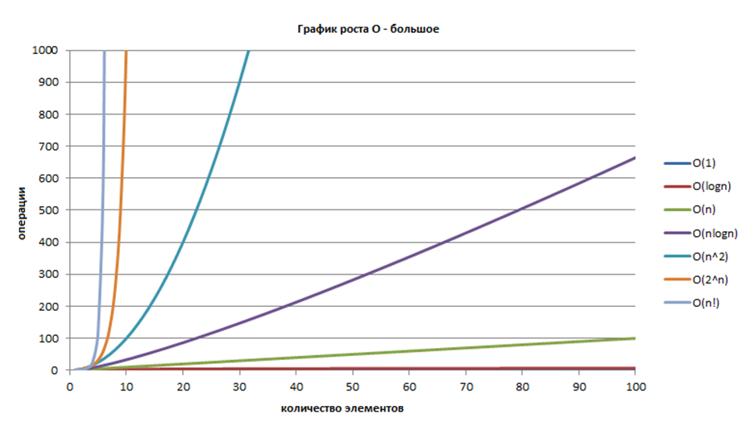 |

**Порядок роста** описывает то, как сложность алгоритма растет с увеличением количества входных данных чаще он представлен в виде О-нотации. **Используем высшую степень, как порядок роста**, потому что она сильнее всех влияет на то, как сложность будет изменяться. <br/>
> [Ссылка на видео лекции КТ](https://youtu.be/8BniwdaAUMc?list=PLrS21S1jm43jz48qjdfYNpuIPgL3lNJ_o) <br/>
> [Сыллка на лекцию Нияза Нигматуллина (CSC)](https://www.youtube.com/watch?v=k850DNwR9xw) <br/>


## 2. Оценка сложности алгоритма по памяти.

Оценка сложности по памяти - сколько занимает памяти алгоритм.

- 1 переменная — 1 пункт сложности
- Массив размером n — n пунктов сложности
- Строка длинной n — n пунктов сложности

Оценка сложности алгоритма по памяти оценивает только **дополнительную память**, используемую алгоритмом. $М(n)$ — функция, оценивающая сложность по памяти. <br/>

Есть **3 функции** оценивающие память: $O$, $\Theta$, $\Gamma$. <br/>

Так же, как и в случае с оценкой по времени:
1. $O$ - верхняя граница
2. $\Theta$ - точная оценка
3. $\Gamma$ - нижняя оценка

**NB! РЕКУРСИВНЫЙ ВЫЗОВ ТРАТИТ ПАМЯТЬ**

> 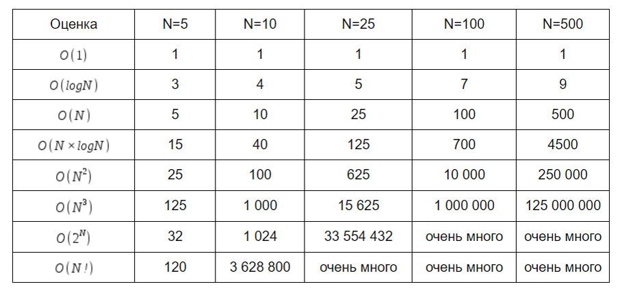


## 3. Сортировка вставками

> 

### Принцип сортировки вставками:
- Инвариант*: первый элемент считается отсортированным.
- Просматриваем элементы слева направо от `j + 1` и до конца.
- Выполняем вставку отсортированного элемента в отсортированную часть
- После вставки увеличиваем отсортированную часть на 1.

***Инвариант** - утверждение, которое верно **до** выполнения цикла, **во время** выполнения цикла и **после** выполнения цикла.

### Cложность:
**По времени:**
> - Лучший случай: $O(n)$ (если массив и так отсортирован).
> - Средний случай: $O(n^2)$.
> - Худший случай: $O(n^2)$ (если массив отсортирован наоборот). <br/>

**По памяти:**
> - Во всех случаях $O(1)$, потому что используем одну переменную во всех случаях.

### Устойчивость - УСТОЙЧИВАЯ

### Реализации:
- Меняем элемент, который хотим вставить каждый раз при сравнении его с другими элементами
- Сравниваем элемент с элементами отсортированной части и двигаем её пока не найдем позицию нашего элемента.

### Псевдокод:
Реализация первого алгоритма взятая с [викиконспектов](https://neerc.ifmo.ru/wiki/index.php?title=%D0%A1%D0%BE%D1%80%D1%82%D0%B8%D1%80%D0%BE%D0%B2%D0%BA%D0%B0_%D0%B2%D1%81%D1%82%D0%B0%D0%B2%D0%BA%D0%B0%D0%BC%D0%B8) и презы Антона.
```
function insertionSort(a):
  for i = 1 to n
    j = i - 1
    while j >= 0 and a[j] > a[j + 1] 
      swap(a[j], a[j + 1])
      j--
```


## 4. Сортировка слиянием

> 

### Метод декомпозиции: разделяй и властвуй
> 1. Задача разбивается на несколько меньших экземпляров той же задачи.
> 2. Решаются сформированные меньшие экземпляры задачи (обычно рекурсивно).
> 3. При необходимости решение формируется как комбинация решений меньших экземпляров задачи.

Задачу сортировки массива также можно решить с помощью метода декомпозиции. Примером такого решения является *сортировка слиянием*.

### Принцип сортировки слиянием:
> - На рекурсивном спуске разбиваем массив пополам пока длина итоговых подмассивов не будет равна 1.
> - На рекурсивном подъёме сливаем полученные массивы в отсортированный массив.

> 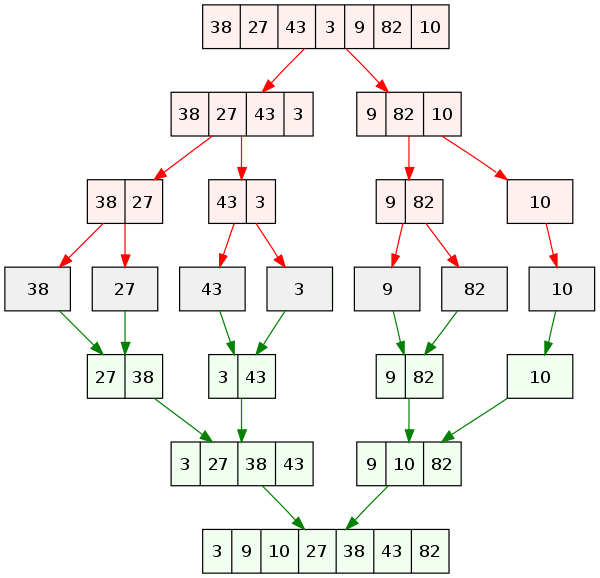 <br/>
> Рекурсивный спуск (красный) и рекурсивный подъем (зеленый).

### Нерекурсивный метод
Нерекурсивный метод работает оптимальнее, потому что не использует память, которую использовал бы для вызова функций. В итеративной реализации мы разбиваем массив на подмассивы длины 1. Вместе сливаем четные и нечетные подмассивы. После этого мы умножаем длину подмассива на 2 и повторяем процедуру слияния до тех пор, пока не отсортируется массив.

> 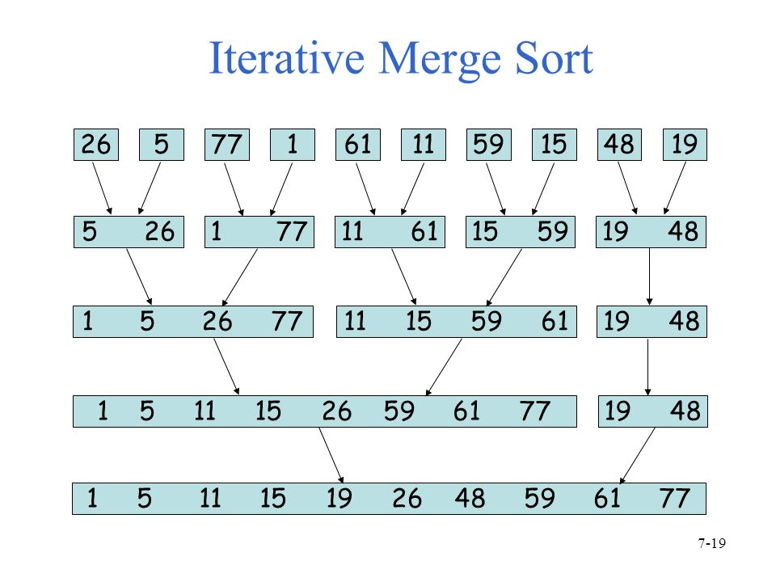 <br/>
> Итеративная сортировка слиянием.

### Сложность алгоритма:
**Сложность по времени:**
> - Во всех случаях сложность: $O(n \cdot logn)$, где $n$ это для слияния, а $logn$ для разбиения.

**Сложность по памяти:**
> - Сложность $O(n)$, потому что нужен вспомогательный массив.
> - Существует реализация без доп. массива, но лучше об этом не говорить на защите...

### Устойчивость - УСТОЙЧИВАЯ

### Псевдокод:

#### Слияние
Идея слияния в том, чтобы соединять два отсортированных подмассива в один большой отсортированный подмассив.

Алгоритм слияния с [викиконспектов](https://neerc.ifmo.ru/wiki/index.php?title=%D0%A1%D0%BE%D1%80%D1%82%D0%B8%D1%80%D0%BE%D0%B2%D0%BA%D0%B0_%D1%81%D0%BB%D0%B8%D1%8F%D0%BD%D0%B8%D0%B5%D0%BC).
```
function merge(a : int[n]; left, mid, right : int):
    it1 = 0
    it2 = 0
    result : int[right - left]
  
    while left + it1 < mid and mid + it2 < right
        if a[left + it1] < a[mid + it2]
            result[it1 + it2] = a[left + it1]
            it1 += 1
        else
            result[it1 + it2] = a[mid + it2]
            it2 += 1
  
    while left + it1 < mid
        result[it1 + it2] = a[left + it1]
        it1 += 1
  
    while mid + it2 < right
        result[it1 + it2] = a[mid + it2]
        it2 += 1
  
    for i = 0 to it1 + it2
        a[left + i] = result[i]
```

#### Рекурсивный алгоритм
Рекурсивный алгоритм с [викиконспектов](https://neerc.ifmo.ru/wiki/index.php?title=%D0%A1%D0%BE%D1%80%D1%82%D0%B8%D1%80%D0%BE%D0%B2%D0%BA%D0%B0_%D1%81%D0%BB%D0%B8%D1%8F%D0%BD%D0%B8%D0%B5%D0%BC).
```
function mergeSortRecursive(a : int[n]; left, right : int):
    if left + 1 >= right
        return
    mid = (left + right) / 2
    mergeSortRecursive(a, left, mid)
    mergeSortRecursive(a, mid, right)
    merge(a, left, mid, right)
```

#### Нерекурсивный алгоритм
Нерекурсивный алгоритм с [викиконспектов](https://neerc.ifmo.ru/wiki/index.php?title=%D0%A1%D0%BE%D1%80%D1%82%D0%B8%D1%80%D0%BE%D0%B2%D0%BA%D0%B0_%D1%81%D0%BB%D0%B8%D1%8F%D0%BD%D0%B8%D0%B5%D0%BC).
```
function mergeSortIterative(a : int[n]):
    for i = 1 to n, i *= 2
        for j = 0 to n - i, j += 2 * i
            merge(a, j, j + i, min(j + 2 * i, n))
```

> [Ссылка на видео лекции КТ](https://www.youtube.com/watch?v=8BniwdaAUMc&list=PLrS21S1jm43jz48qjdfYNpuIPgL3lNJ_o) <br/>
> [Сыллка на лекцию Нияза Нигматуллина (CSC)](https://www.youtube.com/watch?v=MMBi2m2RHrQ&list=PLlb7e2G7aSpTZN_zRrbpVJUvB-pTuM_VL&index=2)


## 5. Быстрая сортировка

>  <br/>
> Работа быстрой сортировки.
> Быстрая сортировка также является примером метода "разделяй в властвуй".

### Почему быстрая сортировка названа "быстрой"?
!TODO

### Нерекурсивный метод
!TODO

### Сложность алгоритма:
**Сложность по времени:**
> - Лучший случай: $O(n \cdot logn)$.
> - Средний случай: $O(n \cdot logn)$.
> - Худший случай: $O(n^2)$ (anti quick sort).

**Сложность по памяти:**
> - Лучший случай: $O(logn)$.
> - Средний случай: $O(logn)$.
> - Худший случай: $O(n)$ (anti quick sort).

$O(logn)$ памяти расходуется на рекурсивные вызовы.

### Anti Quick Sort
Худший случай. Если каждый раз мы будем выбирать опорным элементом максимальный, то массив будет разбиваться на два подмассива: в одном будет одно значение - опорный элемент, а в другом будут остальные значения.

Для построения такого массива нужно итеративно вставлять в середину (место опорного) больший элемент. Псевдокод мой.
```
function AntiQuickSort(a: int[n]):
    a[0] = 1
    a[1] = 2

    for i = 2 to n
        a[i] = i + 1
        swap(a[i], a[i / 2])
```

### Устойчивость - НЕ УСТОЙЧИВАЯ

### Псевдокод
Псевдокод с [википедии](https://ru.wikipedia.org/wiki/%D0%91%D1%8B%D1%81%D1%82%D1%80%D0%B0%D1%8F_%D1%81%D0%BE%D1%80%D1%82%D0%B8%D1%80%D0%BE%D0%B2%D0%BA%D0%B0).
```
 algorithm quicksort(A, low, high) is
    if low < high then
        p:= partition(A, low, high)
        quicksort(A, low, p)
        quicksort(A, p + 1, high)
```

#### Разбиение Ломуто:
За опорный элемент берется последний элемент неотсортированного подмассива. На место элемента `a[i]` ищется элемент, меньший либо равный опорному. Если он нахоодится, мы свапаем `a[i]` и `a[j]`. Как только мы доходим до конца массива, мы свапаем опорный с `a[i]`. После этого возвращаем индекс `i`.

Псевдокод с [википедии](https://ru.wikipedia.org/wiki/%D0%91%D1%8B%D1%81%D1%82%D1%80%D0%B0%D1%8F_%D1%81%D0%BE%D1%80%D1%82%D0%B8%D1%80%D0%BE%D0%B2%D0%BA%D0%B0).
```
algorithm partition(A, low, high) is
    pivot := A[high]
    i := low
    for j := low to high - 1 do
        if A[j] <= pivot then
            swap A[i] with A[j]
            i := i + 1
    swap A[i] with A[high]
    return i
```

#### Разбиение Хоара:
Разбиение Хоара (оригинальное) эффективнее Ломуто, так как происходит в три раза меньше обменов элементов, так же оно эффективнее, когда все элементы равны.

Серединный элемент выбирается опорным (есть оптимизация, где выбирается медиана из первого, последнего и серединного). Есть два индекса: `i` и `j`. `a[i]` меньше опорного и расположен в начале массива. `a[j]` больше опорного и расположен в конце массива. Если `a[i]` больше опорного, а `a[j]` меньше опорного, то они меняются местами. Если `i` и `j` пересекаются, то цикл завершается.

**NB! Конечная позиция опорного элемента может не совпадать с серединой массива.**

Псевдокод с [википедии](https://ru.wikipedia.org/wiki/%D0%91%D1%8B%D1%81%D1%82%D1%80%D0%B0%D1%8F_%D1%81%D0%BE%D1%80%D1%82%D0%B8%D1%80%D0%BE%D0%B2%D0%BA%D0%B0).
```
algorithm partition(A, low, high) is
   pivot:= A[(low + high) / 2]
   i:= low
   j:= high
   loop forever
       
       while A[i] < pivot 
              i:= i + 1
       while A[j] > pivot
              j:= j - 1
       if i >= j then
           return j
       swap A[i++] with A[j--]
```

> [Ссылка на видео лекции КТ](https://www.youtube.com/watch?v=CWiDEus3rDA&list=PLrS21S1jm43jz48qjdfYNpuIPgL3lNJ_o&index=3) <br/>
> [Ссылка на лекцию Нияза Нигматуллина (CSC)](https://www.youtube.com/watch?v=kaIP2dkBlbQ&list=PLlb7e2G7aSpTZN_zRrbpVJUvB-pTuM_VL&index=3)


## 6. Сортировка подсчетом

>  <br/>
> Сортировка подсчетом 

**NB! В основном применяется, когда мощность алфавита равна входным данным.**

Есть исходный массив `a[n]` чисел от 0 до k - 1. Заводится массив `c[k]` для подсчета количества повторений каждого числа в `a[n]`.

### 1. Не устойчивая - целые числа

#### Псевдокод
 Итерируемся по `a[n]`, считая количество повторений каждого элемента значения `i`, увеличивая `c[i]`. После этого записываем каждое число от 0 до k по `c[i]` раз в `a[n]`.

Псевдокод с [викиконспектов](https://neerc.ifmo.ru/wiki/index.php?title=%D0%A1%D0%BE%D1%80%D1%82%D0%B8%D1%80%D0%BE%D0%B2%D0%BA%D0%B0_%D0%BF%D0%BE%D0%B4%D1%81%D1%87%D1%91%D1%82%D0%BE%D0%BC).
```
function simpleCountingSort(A: int[n]): 
    for number = 0 to k - 1
        C[number] = 0 
    for i = 0 to n - 1
        C[A[i]] = C[A[i]] + 1;     
    pos = 0;
    for number = 0 to k - 1
        for i = 0 to C[number] - 1
            A[pos] = number;
            pos = pos + 1;
```

#### Сложность
**Сложность по времени:**
> Все случаи: $O(n + k)$, т.к. время работы зависит от того,  насколько большой алфавит нам придется взять для составления доп. массива.

**Сложность по памяти:**
> Все случаи: $O(k)$ - на дополнительный массив.

### 2. Устойчивая - целые числа и объекты

#### Псевдокод
> 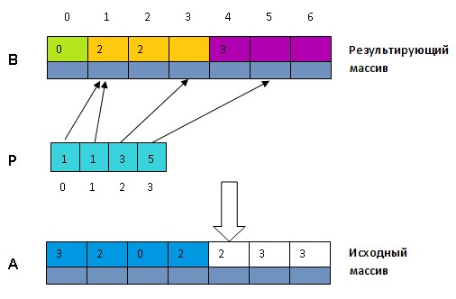 <br/>
> Сложная сортировка подсчетом 

Для того, чтобы сортировать сложные объекты нужно создать второй массив `b[n]`, куда будет записываться результат. Сначала считаем каждый элемнт по его ключу `key` и заносим данные в `c[key]`. После этого мы приводим массив `c[k]` к виду начальных индексов (суммируем каждый элемент с суммой предыдущих и сдвигаем массив вправо на 1) каждого из блоков в массиве `b[n]`. После этого итерируемся по `a[n]` и заполняем `b[n]`, используя индексы из `c[k]`, при заполении увеличивая `c[key]` на 1.

Псевдокод с [викиконспектов](https://neerc.ifmo.ru/wiki/index.php?title=%D0%A1%D0%BE%D1%80%D1%82%D0%B8%D1%80%D0%BE%D0%B2%D0%BA%D0%B0_%D0%BF%D0%BE%D0%B4%D1%81%D1%87%D1%91%D1%82%D0%BE%D0%BC)
```
function complexCountingSort(A: int[n], B: int[n]):
    for i = 0 to k - 1
        P[i] = 0;         
    for i = 0 to length[A] - 1
        P[A[i].key] = P[A[i].key] + 1;     
    carry = 0;
    for i = 0 to k - 1
        temporary = P[i];
        P[i] = carry;
        carry = carry + temporary;     
    for i = 0 to length[A] - 1
        B[P[A[i].key]] = A[i];
        P[A[i].key] = P[A[i].key] + 1;
```

#### Сложность
**Сложность по времени:**
> Все случаи: $O(n)$

**Сложность по памяти:**
> Все случаи: $O(n + k)$, $k$ элементов на доп. массив + $n$ на основной.


## 7. Цифровая сортировка

>  <br/>
> **Цифровая сортировка** - один из алгоритмов сортировки, использующих внутреннюю структуру сортируемых объектов.

**NB! Обязательно используем линейные сортировки.**

> 


## 8. Стек
> 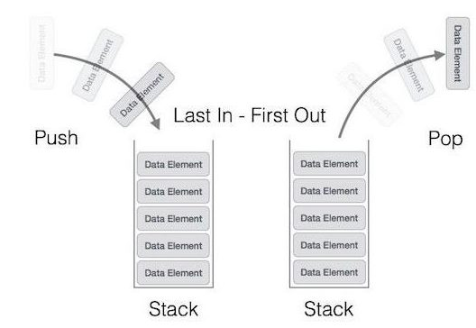 <br/>
> Стек

**Стек** - структура данных, представляющая из себя упорядоченный набор элементов, в которой добавление новых элементов и удаление существующих производится с одного конца, называемого вершиной стека. Притом первым из стека удаляется элемент, который был помещен туда последним, то есть в стеке реализуется стратегия last-in, first-out — LIFO. Примером стека в реальной жизни может являться стопка тарелок: когда мы хотим вытащить тарелку, мы должны снять все тарелки выше. [[викиконспекты]](https://neerc.ifmo.ru/wiki/index.php?title=%D0%A1%D1%82%D0%B5%D0%BA)

| Операция | Описание | Big O |
| - | - | - |
| empty | проверка стека на наличие элементов | $O(1)$ |
| push  | операция вставки нового элемента в `head` | $O(1)$ |
| pop  | операция снятия нового элемента с `head` | $O(1)$ |
| search | поиск элемента | $O(n)$ |

### Реализации
#### На массиве
> 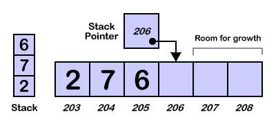 <br/>

Пусть `head` - индекс массива.

**Empty** <br/>
Индекс в начале массива.

```
boolean empty(arr[], head):
    return head == 0
```

**Push** <br/>

```
function push(arr[], head, element):
    arr[head] = element
    head++
```

**Pop** <br/>
Снимаем, если в стеке есть элементы.

```
element pop(arr[], head):
    if empty then error "underflow"
    head--
    return arr[head]
```

**Критерий переполнения** - `head` выходит за границы массива.

#### На списке
> 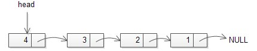 <br/>

Пусть будет задана структура `Node` для элементов стека. `head` будет указателем на последний добавленный `Node`.
```
structure Node
    int value
    Node* next
```

**Empty** <br/>
```
boolean empty(head):
    if head == null return true
    return false
```

**Push** <br/>
```
function push(head, value) {
    Node* new_head
    
    new_head -> value = value
    new_head -> next = head
    
    head = new_head
}
```

**Pop** <br/>
```
int pop(head) {
    if empty then error "underflow"

    int temp = head -> value
    Node* new_head = head -> next
    
    delete head
    head = new_head
    
    return temp
}
```

#### Макстек
**Макстек** - стек, в котором можно найти текущий максимум (за $O(1)$, разумеется).

Для этого будем держать максимум в каждом элементе. Добавляя, будем изменять его, если добавляемый элемент больше максимума (единственное отличие от обычного стека).
```
structure Node
    int value
    int max
    Node* next
```


## 9. Очередь
>   <br/>
> Очередь

**Очередь** - это структура данных, добавление и удаление элементов в которой происходит путём операций push и pop соответственно. Притом первым из очереди удаляется элемент, который был помещен туда первым, то есть в очереди реализуется принцип first-in, first-out — FIFO. У очереди имеется голова (англ. head) и хвост (англ. tail). Когда элемент ставится в очередь, он занимает место в её хвосте. Из очереди всегда выводится элемент, который находится в ее голове. [[викиконспекты]](http://neerc.ifmo.ru/wiki/index.php?title=%D0%9E%D1%87%D0%B5%D1%80%D0%B5%D0%B4%D1%8C)

| Операция | Описание | Big O |
| - | - | - |
| empty | проверка стека на наличие элементов | $O(1)$ |
| push  | операция вставки нового элемента в `tail` | $O(1)$ |
| pop  | операция снятия нового элемента с `head` | $O(1)$ |
| search | поиск элемента | $O(n)$ |

### Реализации
#### На массиве
> 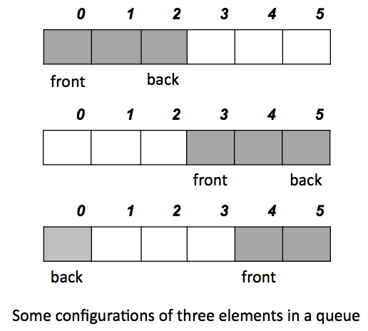 <br/>

Пусть `head` и `tail` - индексы массива. При этом массив у нас циклический и при выходе любого из индексов за границы мы ставим их в начало.

**Empty** <br/>

**Push** <br/>

**Pop** <br/>

**Критерий переполнения** - `head` равен `tail` в непустой очереди.

#### На списке
> 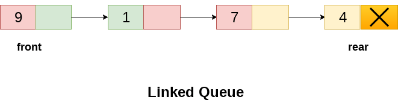 <br/>

**Empty** <br/>

**Push** <br/>

**Pop** <br/>

#### На двух стеках
[Stackoverflow - How to implement a queue using two stacks?](https://stackoverflow.com/questions/69192/how-to-implement-a-queue-using-two-stacks)

### Приоритетная очередь

**Приоритетная очередь** — это абстрактная структура данных наподобие стека или очереди, где у каждого элемента есть приоритет. Элемент с более высоким приоритетом находится перед элементом с более низким приоритетом. Обычно приоритетные очереди реализуются с помощью куч. [(викиконспекты)](http://neerc.ifmo.ru/wiki/index.php?title=%D0%9F%D1%80%D0%B8%D0%BE%D1%80%D0%B8%D1%82%D0%B5%D1%82%D0%BD%D1%8B%D0%B5_%D0%BE%D1%87%D0%B5%D1%80%D0%B5%D0%B4%D0%B8)

**Почему неудобно на списке?** <br/>
!TODO

**Почему удобно на куче?** <br/>
!TODO


## 10. Односвязный список
**Связный список** (англ. List) — структура данных, состоящая из элементов, содержащих помимо собственных данных ссылки на следующий и/или предыдущий элемент списка. С помощью списков можно реализовать такие структуры данных как стек и очередь <br/>
**Односвязный список** - это динамическая структура, с расширением памяти, где каждый узел хранит в себе какие-то **значения** и **указатель на следующий элемент**, для конца списка указатель равен nullptr (указатель в никуда) <br/>
> 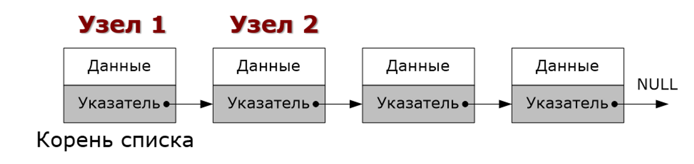 <br/>

Односвязный список это динамическая память, где каждый узел хранит в себе какие-то значения и указатель на следующий элемент, для конца списка указатель равен nullptr (указатель в никуда).

### Код:

**Реализация node**
```cpp
struct Node {
    Node *next;
    int data;
};
```
Значения указателя на следующий узел по умолчания nullptr
<br/>
**Реализация List**
```cpp
struct list {
    Node* head = nullptr;
    Node* tail = nullptr;
};
```
Для самого списка храним указатели на первый Node (head) и последнюю (tail).
<br/>
**Добавление нового элемента в конец O(1)**
```cpp
void PushBack(int num) {
    node* new_node = new node(num);
    if (head == nullptr) {  // проверка на наличие узлов
				head = new_node;
        new_node->maximum = num;
    } else {
        if (num > tail->maximum) {
            new_node->maximum = num;
        } else {
            new_node->maximum = tail->maximum; // если новое число меньше максимума, то просто кладем в поле максимума предыдущий максимум
        }
        new_node->next = tail; // связка ноды с последним элементов
    }
    tail = new_node; // перевод tail на новый элемент
}
```
<br/>

**Удаление первой Node 0(1)**
```cpp
void remove_head() {
    if (head == nullptr) return;
    Node* p = head;
    head= p->next;
    delete p;
}
```
<br/>

**Удаление последней Node O(n)**
```cpp
void remove_tail() {
    if (tail == nullptr) return;  //проверка на наличие узлов 
    if (first == last) {         // проверка на наличие только одной ноды
        remove_head();
        return;
    }
    Node* p = head;
    while (p->next != tail) p = p->next; // идем пока не наткнемся на tail
    p->next = nullptr;
    delete tail;
    tail = p;
}
```
<br/>

**Вывод максимума O(1)**
```cpp
int Max() {
	return tail->max;
}
```
Благодаря тому, что мы храним максимум как поле для всех предыдущих элементов и обновляем его каждый раз в push_back, вывод максимума 0(1)

## 11. Двусвязный список

> 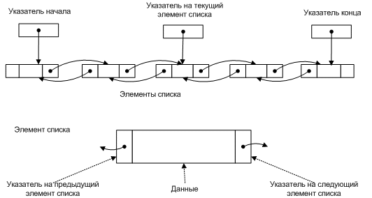 <br/>

**Двусвязный список** - базовая структура данных, состоящая из узлов (где хранятся данные) и ссылок на следующий и предыдущий узлы (для последнего узла ссылка на следующий является NULL указателем и для первого узла ссылка на предыдущий является NULL указателем). Принципиальным преимуществом списка перед массивом является то, что элементы не хранятся в последовательном блоке (куске) памяти, что позволяет легко вставлять и удалять элементы. 

**Основным отличием** двусвязного списка от односвязного является то, что каждой узел (Node) имеет указатель на следующий и предыдущий элементы, а не только на следующий как в случае с односвязным списком.  

**XOR связный список:** Иногда вместо двух указателей хранят только их XOR ради уменьшения количества потребляемой памяти. В таком списке каждый следующий указатель вычисляется за счет предыдущего. 

 **Оценка времени операций:**
 | Операция | Оценка времени |
 | --- | --- |
 | Вставка в начало | $O(1)$ |
 | Вставка в конец (есть указатель на конец) | $O(1)$ |
 | Вставка в конец (нет указателя на конец) | $O(n)$ |
 | Вставка в произвольную позицию | $O(n)$ |
 | Удаление первого элемента | $O(1)$ |
 | Удаление первого элемента | $O(1)$ |
 | Удаление последнего элемента (нет указателя на конец) | $O(n)$ |
 | Удаление произвольного элемента (есть указатель на него) | $O(1)$ |
 | Удаление произвольного элемента (нет указателя на него) | $O(n)$ |
 | Найти элемент в списке | $O(n)$ |

### Код:
**Реализация node**
```cpp
struct Node {
    Node *next;
    Node *prev;
    int data;
};
```
Значения указателя на следующий узел по умолчания nullptr
<br/>

**Реализация List**
```cpp
struct List{
    Node *head = nullptr;
    Node *tail = nullptr;
};
```
<br/>

**Проверка наличий элемента в списке**
```cpp
bool empty() {
    if (head == nullptr) {
        return true;
    }
    return false;
};
```
<br/>

**Добавление элемента**
```cpp
void push(int data) {
    struct Node *n;
    n = new Node();
    n->data = data;
    if (empty()) {
        n->prev = nullptr;
        n->next = nullptr;
        head = n;
        tail = n;
    } else {
        tail->next = n;
        n->next = nullptr;
        n->prev = tail;
        tail = n;
    }
}
```
<br/>

**Удаление элемента из начала**
```cpp
void pop() {
    std::cout << head->data;
    if (tail == head) {
        tail = nullptr;
        head = nullptr;
    }
    else {
        head->next->prev = nullptr;
        head = head->next;
    }
}
```
<br/>

**Удаление элемента из конца**
```cpp
void pop_stack() {  //удаление из конца
    if (tail == head) {
        tail = nullptr;
        head = nullptr;
    }
    else {
        tail->prev->next = nullptr;
        tail = tail->prev;
    }
}
```


## 12. Циклический список

На самом деле подразумевается цикл в списке, а не циклический список, как структура данных, что же такое цикл в списке? Проще всего это объяснить следующим образом: 

> 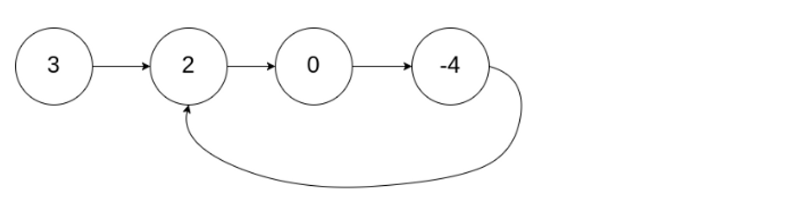 <br/>

То есть это такой список, в котором последний элемент ссылается на один из предыдущих. Заметим, что он ссылается не обязательно на начало списка, а именно на любой предыдущий элемент. Возможно даже на себя, то есть существует список, состоящий из 1 элемента, который сам на себя указывает.

 **Способы поиска цикла в списке:**

1. “Покраска” элементов, по которым мы проходили. Для этого можно использовать либо поле в структуре Node, либо создать куда мы будем добавлять уже использовавшиеся Node, либо сделать массив, с уже использованными Node. Рассмотрим подробно каждый из способов:
    
    
    | Плюсы | Минусы |
    | --- | --- |
    | Легкая реализация, если есть доступ к структуре | Может не быть доступа к структуре, при правильной реализации уровней доступа в проекте  |
    | Алгоритм работает за O(n) | Используется дополнительная память, такая возможность есть не всегда |
    |  | После каждой попытки поиска цикла необходимо обнулять все значения flag |
    |  |  |
    1. Добавление поля в структуру Node
        
        ```cpp
        #include <iostream>
        
        using namespace std;
        
        template <class T>
        struct Node {
        	bool flag = false;
        	T val;
        	Node<T>* next;
        };
        
        bool find_cycle(Node<typename>* head) {
        	Node<typename>* copy = head;
        	while (!copy.flag && copy->next != nullptr) {
        		copy.flag = true;
        		copy = copy.next;
        	}
        
        	Node<typename>* cop2 = head;
        	while (copy2.flag && copy2->next != nullptr) {
        		copy2.flag = false;
        		copy2 = copy2->next;
        	}
        
        	return copy->next == nullptr;
        }
        ```
        
    2. Создание массива
        
        
        | Плюсы | Минусы |
        | --- | --- |
        | Простая реализация | Надо использовать дополнительную память |
        | Не надо менять исходный код структуры, что не нарушает уровни доступа | Долгий поиск элемента по массиву, что делает скорость его работы O(n^2) |
        
        ```cpp
        #include <iostream>
        #include <vector>
        
        using namespace std;
        
        template <class T>
        struct Node {
        	bool flag = false;
        	T val;
        	Node<T>* next;
        };
        
        bool find_cycle(Node<typename>* head) {
        	Node<typename>* copy = head;
        	vector<typename> arr;
        	
        	while (find(arr.begin(), arr.end(), copy), copy->next != nullptr) {
        		arr.emplace_back(copy);
        		copy = copy->next;
        	}
        
        	return copy->next == nullptr;
        }
        ```
        
    3. Создание Map
        
        
        | Плюсы | Минусы |
        | --- | --- |
        | Не надо менять исходный код структуры, что позволяет не нарушать уровни доступа | Надо использовать дополнительную память |
        | Простая реализация | Скорость работы про использовании обычного map падает до O(nlogn) |
        
        ```cpp
        #include <iostream>
        #include <map>
        
        using namespace std;
        
        template <class T>
        struct Node {
        	bool flag = false;
        	T val;
        	Node<T>* next;
        };
        
        bool find_cycle(Node<typename>* head) {
        	Node<typename>* copy = head;
        	map<Node<typename>*, bool> stepped;
        	
        	while (stepped.find(stepped) == it.end() && copy->next != nullptr) {
        		stepped[copy] = true;
        		copy = copy->next;
        	}
        	
        	return copy == nullptr;
        }
        ```
        
    
2. Алгоритм зайчика черепашки

Общим недостатком всех вышеперчисленных способов является дополнительное использование памяти. Как этого избежать? Для решения за $O(n)$ без дополнительной памяти используется алгоритм кролика-черепашки. 

Рассмотрим его подробно:

> 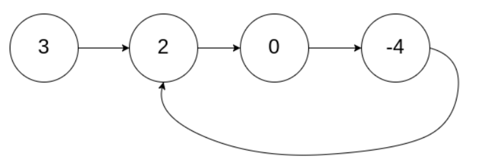 <br/>

1) Ставим черепашку в позицию 0 (в данном случае — $node$ со значение 3)

2) Кролик ставится в позицию, которая на 2 больше, чем позиция черепашки (в данном случае —нода со значением 0)

3) Черепашка делает ход на один $node$ вперед

4) Кролик делает ход на две $node$ вперед

Стоит отметить, что необходимо обработать крайние случаи: дан пустой список или список состоящий из 1 $node$

5) Дальнейший алгоритм прост:  идем по листу кроликом и черепашкой, пока или не встретятся или кролик не дойдет до конца

Приведем код данного алгоритма:

```cpp
struct ListNode {
     int val;
     ListNode *next;
     ListNode(int x) : val(x), next(NULL) {}
 };
 

  bool hasCycle(ListNode *head) {
      if (head == nullptr || head->next == nullptr)
          return false;
      ListNode* rabbit = head->next->next;
      ListNode* turtle = head;
      while (rabbit != turtle && turtle != nullptr && rabbit != nullptr) {
          turtle = turtle->next;
          if (rabbit->next != nullptr)
              rabbit = rabbit->next->next;
          else 
              return false;
      }
      
      if (rabbit == turtle && turtle->next != nullptr && rabbit->next != nullptr)
          return true;
      return false;
  }
```

Кроме того, существует модификация алгоритма кролика-черепашки, которая позволяет находить начало цикла (за начало будем считать $node$, отмеченную на рисунке).

> 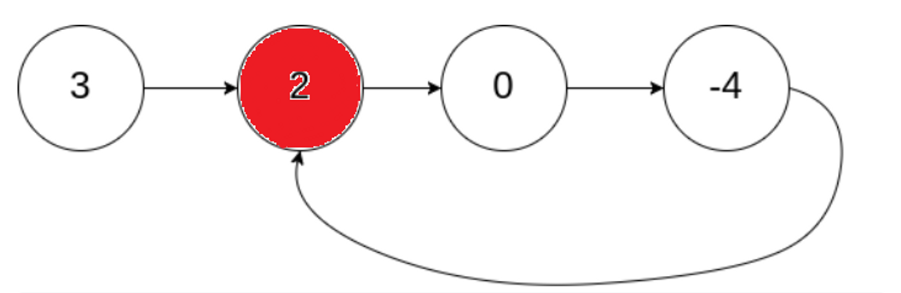 <br/>

Чтобы найти эту $node$ требуется запустить обычный алгоритм кролика-черепашки. Так мы можем удостовериться, что цикл есть, и найти дальнейшую позицию для запуска. Далее мы запускаем вторую черепашку с $node$ со значение 3. Теперь будем ходить двумя черепашками по одной $node$, пока они не встретятся. Гарантируется, что они встретятся в $node$ , которая является началом цикла.

Приведем код данного алгоритма:

```cpp
struct ListNode {
  int val;
  ListNode *next;
  ListNode(int x) : val(x), next(NULL) {}
};

ListNode* detectCycle(ListNode *head) {
    if (head == nullptr)
        return head;
    ListNode* rabbit = head;
    ListNode* turtle = head;
    while (rabbit != nullptr && rabbit->next != nullptr) {
        rabbit = rabbit->next->next;
        turtle = turtle->next;
        
        if (rabbit == turtle)
            break;
    }
    if (!(rabbit && rabbit->next))
        return nullptr;
        
    while (head != turtle) {
        head = head->next;
        turtle = turtle->next;
    }
        
    return head;
}
```

Добавим, что алгоритм кролика-черепашки является упрощение алгоритма Флойда, который позволяет искать длины кратчайших путей (для всех вершин) в ориентированном графе, если в нем нет циклов. Если в графе есть циклы, то он обнаружает хотя бы один из них.

