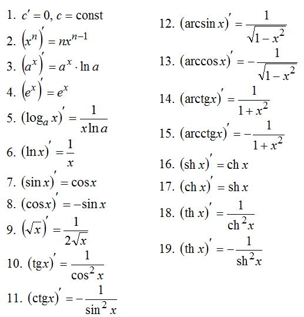
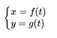
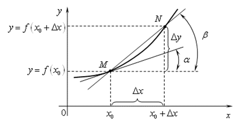
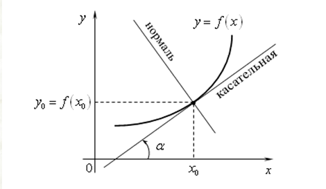
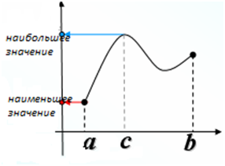
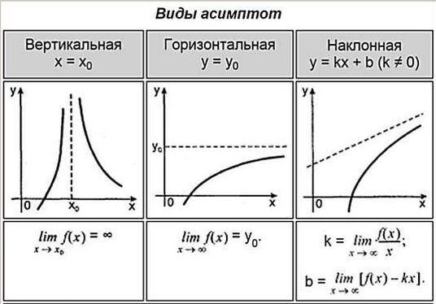
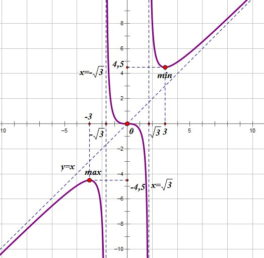
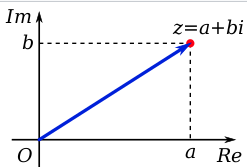
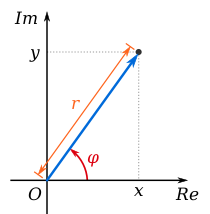

# Список вопросов по математическому анализу

## 1. Множества и операции над ними.

### Множества 

**Множество** — совокупность различных объектов (элементов этого множества), объединенных общим свойством  
**Подмножество**. Множество $B$ называют подмножеством множества $A$ (пишут $B \subset A$ или $A \supset B$ ), если всякий элемент множества B есть в то же время и элемент множества A :  
$B \subset A \Leftrightarrow \forall x \in B \Rightarrow x \in A$  
Также, можно сказать, что *множество* $B$ *вложено (или включено) в множество* $A$  

### Операции над множествами:

  

**1. Объединение**  
Oбъединение множеств состоит из тех и только тех элементов, которые принадлежат *хотя бы одному* из объединяемых множеств  
**2. Пересечение**  
Пересечение множеств состоит из тех и только тех элементов, которые *входят одновременно* в эти множества  
**3. Дополнение**  
Унарная операция нахождения множества всех элементов, *не содержащихся* в данном  
**4. Разность**  
Разность множеств $A$ и $B$ состоит из тех и только тех *элементов множества* $A$ , которые при этом *не входят* в множество $B$  
**5. Симметрическая разность**  
Операция, результатом которой является новое множество, *включающее все элементы исходных множеств*, не принадлежащие *одновременно обоим* исходным множествам  

## 2. Числовые множества. Окрестности.

### Числовые множества:
**Числовые множества** - это *наборы* чисел, объединенных в группы согласно какими-то общим свойствам

1. Натуральные числа
2. Целые числа
3. Рациональные числа
4. Действительные числа
5. Комплексные числа
   
### Окрестность точки

  

**Окрестностью действительной точки $x_0$** - любой открытый интервал, содержащий эту точку:  
$U(x_0) =$ { $x: - \varepsilon_1 < x - x_0 < \varepsilon_2 , \space \varepsilon_1 > 0 , \space \varepsilon_2 > 0$ }   
*Здесь* $\varepsilon_1$ *и* $\varepsilon_2$ *- произвольные числа*

**Эпсилон окрестность точки $x_0$** - множество точек, расстояние от которых до точки $x_0$ меньше $\varepsilon$ :  
$U(x_0) =$ { $x: |x-x_0| < \varepsilon$ }   
*ИЛИ*  
**Эпсилон окрестность точки $x_0$** - интервал, содержащий точку $x_0$ так, что:  
$(x_0 - \varepsilon, x_0 + \varepsilon)$  

**Проколотая окрестность точки $x_0$** - окрестность этой точки, из которой исключили саму точку $x_0$:  
$\stackrel{\circ}{U} (x_0) = U(x_0)$ \ { $x_0$ }  
 

## 3. Логические операции и логические символы. Понятие предиката. Необходимое и достаточное условие.

**Логические операции:**
1. Конъюнкция $\land$
2. Дизъюнкция $\lor$
3. Дополнение $\lnot$
4. Импликация $\to$
5. Симметрическая разность $\Delta$

### Предикат
**Предикат** - это утверждение, высказанное о субъекте (однозначно ложное или правдивое).

### Необходимое и достаточное условие
**Необходимое и достаточное условие** - виды условий, логически связанных с некоторым суждением.  
 
***Необходимыми*** условиями правильности утверждения $А$ называются такие условия, без соблюдения которых утверждение $А$ **заведомо не может быть верным**, а ***достаточными*** условиями правильности утверждения $А$ называются условия, при выполнении которых утверждение $А$ **заведомо верно**.  
> **Пример для понимания**  
> Например, необходимым условием делимости целого числа на 2 является то, чтобы число, будучи записано в десятичной системе счисления, не кончалось цифрой 7. Условие это необходимо, но не достаточно, так как, например, число 23 не кончается цифрой 7 и всё-таки не делится на 2. Достаточным условием делимости числа на 2 является то, чтобы оно кончалось цифрой 0. Это условие достаточно, но не необходимо, так как число 38 не кончается цифрой 0 и все-таки делится на 2. Обычно употребляемый признак делимости на 2 (чтобы число делилось на 2, необходимо и достаточно, чтобы последняя его цифра делилась на 2) является примером условия одновременно необходимого и достаточного. Часто выражение «необходимо и достаточно» заменяется выражением «тогда и только тогда» или же выражением «в том и только в том случае».
 

*ПО ОПРЕДЕЛЕНИЮ*  
> $(A \Rightarrow B)$ верно, если выполняется необходимое и достаточное условие:  
Истинность высказывания B является необходимым условием для истинности высказывания A  
(условие, без которого A не может быть истинным).  
Истинность высказывания A является достаточным условием для истинности высказывания B  
(условие, при котором B является истинным).  
 

> [Маргинал объясняет на стакане](https://www.youtube.com/watch?v=tOz9Ji9GEBM)

## 4. Определение функции. Числовые функции. 

### Определение функции
**Функция** – это соответствие между двумя множествами, причем каждому элементу первого множества соответствует один и только один элемент второго множества  
*ИЛИ*  
**Функция** — правило, по которому любому элементу из области определения ставится в соответствие единственный элемент из области значения.  

### Числовые функции
**Основные элементарные функции:**
| Вид | Название | Функция | График |
| - | - | - | - |
| Константа | Константа | $y = const$ | Прямая, параллельная оси Ox |
| Степенная | Кубическая парабола | $y=x^3$ |   |
| Степенная | Корень | $y = \sqrt{x}$|  |
| Степенная | Гипербола | $y = k/x$ |  |
| Показательная | Экспонента | $y = e^x$ |  |
| Показательная | Показательной функция a > 1 | $y = a^x$ |  |
| Показательная | Показательной функция 1 > a > 0 | $y = a^x$ |  |
| Логарифмическая | Логарифмическая функция a > 1 | $y = log_a x$ |  |
| Логарифмическая | Логарифмическая функция 1 > a > 0  | $y = log_a x$ |  |
| Тригонометрическая | Синус | $y = sin(x)$ |  |
| Тригонометрическая | Косинус | $y = cos(x)$ |  |
| Тригонометрическая | Тангенс | $y = tg(x)$ |  |
| Тригонометрическая | Котангенс | $y = ctg(x)$ |  |
| Обратная тригонометрическия | Арксинус | $y = arcsin(x)$ |  |
| Обратная тригонометрическия | Арккосинус | $y = arccos(x)$ |  |
| Обратная тригонометрическия | Арктангенс | $y = arctg(x)$ |  |
| Обратная тригонометрическия | Арккотангенс | $y = arcctg(x)$ |  |

**Элементарные функции** - функции, полученные из основных элементарных функций с помощью четырех арифметических действий и операции суперпозиции, примененных конечное число раз.  

*Теорема*
> Каждая элементарная функция *непрерывна* в области своего определения  

**Суперпозиция функций** — это функция, полученная из некоторого множества функций путем *подстановки* одной функции в другую или *отождествления* переменных.  
> [(больше про суперпозицию есть на neerc.ifmo.ru)](http://neerc.ifmo.ru/wiki/index.php?title=%D0%A1%D1%83%D0%BF%D0%B5%D1%80%D0%BF%D0%BE%D0%B7%D0%B8%D1%86%D0%B8%D0%B8)

## 5. Определение предела числовой последовательности. Единственность предела. Переход к пределу в неравенствах. 

### Определение предела числовой последовательнсти

**Числовая последовательность** — последовательность, где каждому натуральному значению n по некоторому правилу поставлено в соответствие действительное число $x_n$.

**Определение предела числовой последовательности** - число $a$ называется пределом последовательности { $x_n$ }, если для любого, сколь угодно малого числа $\varepsilon$ найдется такое положительное число $N_\varepsilon$, что для всех номеров больше $N_\varepsilon$, будет выполнено неравенство $|x_n - a| < \varepsilon$.  
**Запись на $(\varepsilon,\space\delta)$ языке:** $\forall \varepsilon > 0 \space \exists N_\varepsilon \in \mathbb{N} : \forall n > N_\varepsilon \Rightarrow |x_n - a| < \varepsilon$
 
>   

### Единственность предела

*Теорема:*
> Если предел есть, то он единственный.

*Доказательство:*
> Пусть последовательность { $a_n$ } сходится и у неё есть 2 предела - $x$ и $y$, такие что $x < y$. Тогда:  
> $\forall \varepsilon > 0 \space \exists N_\varepsilon \in \mathbb{N} : \forall n > N_\varepsilon \Rightarrow |a_n - x| < \varepsilon$  
> $\forall \varepsilon > 0 \space \exists N_\varepsilon \in \mathbb{N} : \forall n > N_\varepsilon \Rightarrow |a_n - y| < \varepsilon$  
> Мы возьмем $\varepsilon$ такую, что $\varepsilon$-окрестности $x$ и $y$ не пересекаются. Но тогда члены последовательности с номерами $n > N_\varepsilon\space$ должны собираться в двух непересекающихся окрестностях, что невозможно. Значит, последовательнось не может иметь более одного предела.

### Переход к пределу в неравенствах

*Теорема:*
> Если элементы *сходящейся* последовательности { $x_n$ }, начиная с некоторого номера, удовлетворяют неравенству $x_n \geq b \space (x_n \leq b)$, то и предел a этой последовательности удовлетворяет неравенству $a \geq b \space (a \leq b)$

*Доказательство*
> Пусть все элементы $x_n$, по крайней мере начиная с некоторого номера, удовлетворяют неравенству $x_n \geq b$. Требуется доказать неравенство $a \geq b$. Предположим, что $a < b$. Поскольку $a$ - предел последовательности { $x_n$ }, то для положительного $\epsilon = b - a$ можно указать номер $N$ такой, что при $n \geq N$ выполняется неравенство $|x_n - a| < b - a$. Это неравенство эквивалентно следующим двум неравенствам: $-(b - a) < x_n - a < b - a$. Используя правое из этих неравенств, получим $x_n < b$, а это противоречит условию теоремы. Случай $x_n \leq b$ рассматривается аналогично. 

**!** *Замечание* **!**
> Элементы *сходящейся* последовательности { $x_n$ } могут удовлетворять строгому неравенству $x_n > b$, однако при этом предел $a$ может оказаться равным $b$. Например, если $x_n = \frac{1}{n}$, то $x_n > 0$, однако $\lim\limits_{n \to \infty} x_n = 0$

*Следствие №1*
> Если элементы $x_n$ и $y_n$ сходящихся последовательностей { $x_n$ } и { $y_n$ }, начиная с некоторого номера, удовлетворяют неравенству $x_n \leq y_n$, то их *пределы* удовлетворяют такому же неравенству: $\lim\limits_{n \to \infty} x_n \leq \lim\limits_{n \to \infty} y_n$  
> В самом деле, элементы последовательности { $y_n - x_n$ } *неотрицательны*, а поэтому *неотрицателен и ее предел* $\lim\limits_{n \to \infty} {y_n - x_n} = \lim\limits_{n \to \infty} y_n - \lim\limits_{n \to \infty} x_n$.  
>  Отсюда следует, что $\lim\limits_{n \to \infty} x_n \leq \lim\limits_{n \to \infty} y_n$

*Следствие №2*
> Если *все* элементы сходящейся последовательности { $x_n$ } находятся на сегменте $[a, b]$, то и ее *предел* c также находится на этом сегменте.  
> В самом деле, так как $a \leq x_n \leq b$, то $a \leq c \leq b$.

## 6. Ограниченность сходящихся последовательностей. Бесконечно малые и бесконечно большие последовательности. Арифметические действия над числовыми последовательностями, имеющими предел.

### Ограниченность сходящихся последовательностей

**Числовая последовательность** называется **ограниченной сверху** (снизу), если *множество ее значений ограничено* сверху (снизу)  
Иначе говоря, числовая последовательность { $x_n$ } ограничена сверху (снизу), если существует такое число $c$ принадлежит $\mathbb{R}$ , что для всех номеров $n$ выполняется неравенство $x_n \leq c$ (соответственно неравенство $x_n \geq c$)  

>   

**Последовательность**, ограниченная как сверху, так и снизу, называется **ограниченной**.  
Таким образом, числовая последовательность { $x_n$ } ограничена, если существуют такие числа: $a \in \mathbb{R}$ и $b \in \mathbb{R}$, что для всех номеров $n$ выполняется условие $a \leq x_n \leq b$. Это условие, очевидно, равносильно тому, что существует такое число $c > 0$, что для всех номеров $n$ имеет место неравенство: $|x_n| < c$  

**Последовательность**, не являющаяся ограниченной сверху (снизу), называется **неограниченной сверху** (снизу), а последовательность, не являющаяся ограниченной, называется **неограниченой**  
Примером неограниченных последовательностей являются бесконечно большие последовательности  
Cледует заметить, однако, что не всякая неограниченная последовательность является бесконечно большой. Так, последовательность $x_n = (-1)^n \cdot n + n$ неограниченная, но ***не*** бесконечно большая.

>  **Бесконечно большой последовательностью** называется последовательность, пределом которой является **бесконечность** (со знаком или без знака)  
>  Последовательность $x_n = n^2$ , $n = 1, 2, ...,$ бесконечно большая и $\lim\limits_{n \to \infty} n^2 = + \infty$

*Теорема*  
> Если числовая последовательность имеет ***конечный*** предел, то она ***ограничена***.  

*Доказательство*  
> Пусть последовательность $x_n \in \mathbb{R}$, $n = 1, 2, ...$, имеет *конечный* предел $\lim\limits_{n \to \infty} x_n = a \in \mathbb{R}$.  
> Тогда согласно определению предела последовательности, взяв $\varepsilon = 1$, получим, что существует такой номер $n_1$, что для всех номеров $n > n_1$ будет выполняться неравентсво $|x_n - a| < 1$ (в определении предела последовательности можно взять любое $\varepsilon > 0$; мы взяли $\varepsilon = 1$)  
>   
> Обозначим через $d$ наибольшее из чисел $1$, $|x_1 - a|$, ..., $|x_{n_1} - a|$, . Тогда, очевидно, в силу условия $|x_n - a| < 1$ для всех $n$ принадлежит $\mathbb{N}$ будет иметь место неравенство $|x_n - a| < d$  
> Это и означает, что **последовательность { $x_n$ } ограничена**.

### Бесконечно малые и бесконечно большие последовательности
**Бесконечно большой последовательностью** называется последовательность, пределом которой является **бесконечность** (со знаком или без знака)  
>  Последовательность $x_n = n^2$ , $n = 1, 2, ...,$ бесконечно большая и $\lim\limits_{n \to \infty} n^2 = + \infty$  

**Бесконечно малой последовательностью** называется последовательность, предел которой равен **нулю** (со знаком или без знака)  
> $\lim\limits_{n \to \infty} \frac{n}{n^2 + 1} = \lim\limits_{n \to \infty} \frac{\frac{n}{n^2}}{\frac{n^2 + 1}{n^2}} = \lim\limits_{n \to \infty} \frac{\frac{1}{n}}{1 + \frac{1}{n^2}} = \frac{0}{1 + 0} = 0$  

### Свойства бесконечно малых
*Свойство I:*  
> Любая конечная линейная комбинация бесконечно малых является бесконечно малой  
*Доказательство:*  
> Функция  $f(x)$  является ограниченной в некоторой окрестности точки $a$ и, следовательно, существует такое число  $B > 0$,  
что  (1) $|f(x)| < B$ для всех  $x$, удовлетворяющих условию (2) $|x- a| < \delta_1$  
Поскольку функция $\alpha(x)$  является бесконечно малой при  $x \rightarrow a$, то для любого произвольно малого числа  ε > 0 существует такое число  $\delta_2$, что неравенство (3) $| \alpha(x) | < \frac{\varepsilon}{2}$ выполняется для всех  $x$, удовлетворяющих условию (4) $|x-a| < \delta_2$ 
Выберем из чисел  $\delta_1$  и  $\delta_2$  наименьшее и обозначим его символом  $\delta$. Тогда условие (5) $|x-a|< \delta$  
является более сильным, чем условия (2) и (4) и поэтому влечет неравенства (1) и (3). 
Таким образом, для любого произвольно малого числа  $\varepsilon > 0$  выполняется неравенство
для всех  $x$  из  $\delta$-окрестности точки  $a$. 
*Свойство II:*  
> Произведение бесконечно малой последовательности на ограниченную последовательность является бесконечно малой.  
*Доказательство:*  
> Пусть  $\varepsilon > 0$  – произвольно малое число;  $\alpha(x)$ и $\beta(x)$ – бесконечно малые функции при $x \rightarrow a$ . Тогда существуют такие положительные числа  $\delta_1$  и $\delta_2$ , что условия (2) и (4) влекут за собой соответствующие неравенства (1) и (3)  
Если  $\delta$ = min( $\delta_1$, $\delta_2$), то условие  (5)  перекрывает оба условия (1) и (3) и, следовательно, 
$|\alpha(x) + \beta(x)| <= |\alpha(x)| + |\beta(x)| < \frac{\varepsilon}{2} + \frac{\varepsilon}{2} = \varepsilon$ 

### Арифметические действия над числовыми последовательностями, имеющими предел
Если последовательности $y_n$ и $x_n$ имеют конечные пределы $\lim\limits x_n = a$ и $\lim\limits y_n = b$, то  

**Сумма (разность) имеет конечный предел**
> $\lim\limits {(x_n \pm y_n)} = a \pm b$

**Произведение имеет конечный предел**
> $\lim\limits {(x_n \cdot u_n)} = a \cdot b$

**Разность имеет конечный предел ( $b \ne 0$ )**
> $\lim\limits {(x_n / y_n)} = a / b$

## 7. Монотонные последовательности. Критерий существования предела монотонных последовательностей. Подпоследовательности. Определение числа “e” (второй замечательный предел).

### Монотонные последовательности

**Убывающие и возрастающие** последовательности называются **монотонными**, а строго убывающие и строго возрастающие - **строго монотонными**  

> Числовая **последовательность** { $x_n$ } называется **возрастающей** (убывающей), если для *всех* $n \in \mathbb{N}$ выполняется неравенство $x_n \leq x_{n+1}$ ( соответственно неравенство $x_n \geq x_{n+1}$)  
> **Возрастающая** (убывающая) последовательность обозначается $x_n \textuparrow$ (соответственно $x_n \textdownarrow$). Если возрастающая (убывающая) последовательность имеет **предел**, равный $a$, то пишут $x_n \textuparrow a$ (соответственно $x_n \textdownarrow a$)  
> Последовательность { $x_n$ } называется **строго возрастающей** (строго убывающей), если для всех $n \in \mathbb{N}$ выполняется неравенство $x_n < x_{n+1}$ (соответственно неравенство $x_n > x_{n+1}$). Строго возрастающая (строго убывающая) последовательность обозначается $x_n \textuparrow \textuparrow$  (соответственно $x_n \textdownarrow \textdownarrow$).  
 
 *Примеры*  
> Последовательность { $1/n$ } строго убывает   
> Последовательность { $n$ } строго возрастает  
> Последовательность { $(-1)^n$ } немонотонная  

### Критерий существования предела монотонных последовательностей

*Теорема (Beйepштpacc)*  
> Всякая возрастающая числовая последовательность { $x_n$ } имеет предел: *конечный*, если она *ограничена* сверху, и *бесконечный*, если она *неограничена* сверху, причем $\lim\limits_{n \to \infty} = \sup$ { $x_n$ }. Аналогично, если { $x_n$ } - убывающая последовательность, то существует (конечный или бесконечный) предел $\lim\limits_{n \to \infty} = \inf$ { $x_n$ } и, следовательно, этот предел *конечен*, если последовательность { $x_n$ } ограничена снизу, и *бесконечен*, если она неограничена снизу  

*Коротко то же самое*  
> Любая монотонная ограниченная последовательность имеет конечный предел, равный точной верхней границе $\sup(x)$ для неубывающей и точной нижней границе $\inf(x)$ для невозрастающей последовательности.  
 

>   

**Верхняя (нижняя) грань (граница)** множества значений числовой последовательности { $x_n$ } называется верхней (нижней) гранью **этой последовательности** и обозначается $\sup$ { $x_n$ } ( соответственно $\inf$ { $x_n$ })  
Иначе говоря, если $x_n \in \mathbb{R}, n = 1, 2, ...,$ и если $\beta = \sup$ { $x_n$ }, то:  
    1) для всех $n \in \mathbb{N}$ имеет место неравенство $x_n \leq \beta$;  
    2) для любого $\beta' < \beta$ существует такое $n_0 \in \mathbb{N}$, что $x_{n_0} < \beta'$.  
    Аналогично, если $\alpha = \inf$ { $x_n$ }, то:  
    1) для всех $n \in \mathbb{N}$ имеет место неравенство $x_n \geq \alpha$;  
    2) для любого $\alpha' > \alpha$ существует такое $n_0 \in \mathbb{N}$, что $x_{n_0} < \alpha'$.  

### Подпоследовательности

*Более простое определение*  
> **Подпоследовательность данной последовательности** — это последовательность, которая может быть получена из данной последовательности путем удаления некоторых элементов или их отсутствия без изменения порядка остальных элементов

*Строгое математическое определение (принцип компактности)*
> Если дана последовательность { $x_n$ } и из некоторых ее членов $x_{n_k}, взятых в порядке возрастания номеров $n_k (k > k'$ равносильно $n_k > n_{k'}$ ), составлена новая последовательность { $x_{n_k}$ }, то она называется **подпоследовательностью последовательности** { $x_n$ }.  
    В подпоследовательности { $x_{n_k}$ } $k$ является номером члена *этой* последовательности, а $n_k$ - его номером в *исходной* последовательности. Ясно, что для всех $k = 1, 2, ...$ имеет место неравенство $n_k \geq k$, и поэтому $\lim\limits_{k \to \infty} n_k = + \infty$  
    Подпоследовательности { $x_{n_k}$ } последовательности { $x_n$ } считаются **различными**, если они соответствуют различным наборам номеров { $n_k$ }  

*Теорема*  
> Из любой *ограниченной* числовой последовательности можно выделить **сходящуюся подпоследовательность**, а из любой *неограниченной* сверху (неограниченной снизу) числовой последовательности - **последовательность, имеющую своим пределом** $+ \infty$ ( соответственно $- \infty$).

## 8. Определение предела функции. Бесконечно малые и бесконечно большие функции. Односторонние пределы.

### Определение предела по Коши
**Запись на $(\varepsilon,\space\delta)$ языке:** $\forall \varepsilon > 0 \space \exists \delta > 0: \forall x \space 0 < |x - x_0| < \delta \Rightarrow |f(x) - a| < \varepsilon$  
> Число $a$ называется пределом функции $f(x)$ при $x \rightarrow x_0$, если $\forall \varepsilon$  (где $\varepsilon$ - сколь угодно малое число)  $\exists \delta > 0$ такое, что для всех значений независимой переменной $x$, находящихся в проколотой $\delta$-окрестности точки $x_0$ будет выполнено неравенство $|f(x) - a| < \varepsilon$.

**Бесконечно малая**
> Функция $f(x)$ называется бесконечно малой при $x \rightarrow x_0$, если $\lim\limits_{x \rightarrow x_0} f(x) = 0$.

**Бесконечно большая**
> Функция $f(x)$ называется бесконечно большой при $x \rightarrow x_0$, если $\lim\limits_{x \rightarrow x_0} f(x) = \infty$.

**Односторонний предел**
> Односторонним пределом называется предел, подразумевающий приближение слева $\lim\limits_{x \rightarrow x_0-} f(x)$ или справа $\lim\limits_{x \rightarrow x_0+} f(x)$.

## 9. Локальные свойства функций, имеющих предел. Свойства пределов, связанные с арифметическими операциями. Теорема о сжатой функции. 

!TODO

## 10. Непрерывные функции. Различные определения непрерывности. Свойства функций, непрерывных в точке. Замечательные пределы. 

!TODO

## 11. Сравнение бесконечно малых функций. Порядок малости. Эквивалентные бесконечно малые. 

!TODO

## 12. Свойства функций, непрерывных на отрезке. Теорема Вейерштрасса об ограниченности и достижимости точных граней. Теорема Коши о промежуточных значениях.

Функция $f(x)$ называется **непрерывной на отрезке** $[a, b]$ (при $a \leq x \leq b$), если она непрерывна во всех точках открытого интервала $(a, b)$ (при $a < x < b$) и непрерывна справа и слева в точках $a$ и $b$, соответственно.

### Свойства функций, непрерывных на отрезке.
> 1. Функция, непрерывная на отрезке $[a, b]$, принимает на нем наибольшее и наименьшее значения.   
> 2. Если функция $f(x)$ непрерывна в точке $х = х_0,$ то существует некоторая окрестность точки $х_0$, в которой функция сохраняет знак.  
> 3. Если функция $f(x)$ определена, монотонна и непрерывна на некотором промежутке, то и обратная ей функция $х = g(y)$ тоже однозначна, монотонна и непрерывна.  
>  4. Теорема Кантора. Функция, непрерывная на отрезке, равномерно непрерывна на нем. *(Это свойство справедливо только для отрезков, а не для интервалов и полуинтервалов.)*  

### Теорема Вейерштрасса об ограниченности и достижимости точных граней

> Если функция $f$ непрерывна на отрезке $[a, b]$, то она ограничена на этом отрезке.  
> [Доказательство](https://1cov-edu.ru/mat-analiz/nepreryvnost-funktsii/na-otrezke/teoremy-vejershtrassa/#proof1)

**Достижимость максимума (минимума) функции на множестве**  
> Функция $f$ достигает своего максимума (минимума) на множестве $X$, если существует такой аргумент $x_m$, для которого
$f(x_m) \geq f(x) \space \space (f(x_m) \leq f(x))$ для всех $x \in X$.

**Достижимость верхней (нижней) грани функции на множестве**
> Функция $f$ достигает своей верхней (нижней) грани на множестве $X$, если существует такой аргумент $x_m \in X$, для которого $f(x_m) = \sup_x f(x) \space \space (f(x_m) = \inf_x f(x))$

Легко заметить, что эти определения эквивалентны.  
Если $x_m \in X$ и $f(x_m) = \max_x f(x)$, то $f(x_m) = \sup_x f(x)$.  
Если $x_m \in X$ и $f(x_m) = \sup_x f(x)$, то $f(x_m) = \max_x f(x)$.  

**Различие между максимумом (минимумом) и верхней (нижней) гранью** в том, что максимум (минимум) принадлежит множеству (в данном случае множеству значений функции), а верхняя (нижняя) грань может не принадлежать этому множеству. Пусть, например, на открытом интервале $X =$ { $x:0 < x < 1$ } задана функция $f(x) = x$. На этом интервале функция имеет верхнюю и нижнюю грани:  
$\sup_{x \in X} f(x) = 1, \space \inf_{x \in X} f(x) = 0$  
Но максимума и минимума не имеет. Действительно, для любого $x_0 \in X$ всегда можно указать такие числа $x_1 = \frac{x_0 + 1}{2}$ и $x_2 = \frac{x_0}{2}$, принадлежащие $X$, значения функции от которых будут больше и меньше $x_0$:  
$f(x_1) > f(x_0), \space f(x_2) < f(x_0)$  
На отрезке $X =$ { $x:0 \leq x \leq 1$ } функция имеет как верхнюю и нижнюю грани, так максимум и минимум:  
$\sup_{x \in X} = \max_{x \in X} = f(1) = 1, \space \inf_{x \in X} f(x) = \min_{x \in X} f(x) = f(0) = 0$.  
Также верхняя (нижняя) грань может равняться плюс (минус) бесконечности: $+ \infty (- \infty )$, а максимум (минимум) не может быть бесконечным числом.  
**Любое множество, в котором определены операции сравнения, имеет верхнюю и нижнюю грани**  

### Вторая теорема Вейерштрасса о максимуме и минимуме непрерывной функции
> Непрерывная на отрезке функция достигает на нем своих верхней и нижней граней или, что тоже самое, достигает на отрезке своего максимума и минимума.  
> [Доказательство](https://1cov-edu.ru/mat-analiz/nepreryvnost-funktsii/na-otrezke/teoremy-vejershtrassa/#proof2)

#### Вторая теорема Больцано – Коши о промежуточном значении
> Пусть функция $f$ непрерывна на отрезке $[a, b]$. И пусть $C$ есть произвольное число, находящееся между значениями функции на концах отрезка: $A = f(a)$ и $B = f(b)$. Тогда существует точка $\xi \in [a, b]$, для которой $f( \xi ) = C$  
> [Доказательство](https://1cov-edu.ru/mat-analiz/nepreryvnost-funktsii/na-otrezke/teorema-boltsano-koshi/#proof1)

*Следствие 1 (первая теорема Больцано – Коши)*  
> Пусть функция $f$ непрерывна на отрезке $[a, b]$. И пусть значения функции на концах отрезка имеют разные знаки: $f(a) > 0, \space f(b) < 0$ или $f(a) < 0, \space f(b) > 0$. Тогда существует точка $\xi \in (a, b)$, значение функции в которой равно нулю: $f(\xi) = 0$

## 13. Монотонность и непрерывность обратных функций. Классификация точек разрыва.

!TODO

## 14. Вывод табличных производных, пользуясь определением. Дифференцирование функции, пользуясь правилами дифференцирования. Дифференцирование сложных, обратных функций и функций, заданных неявно и параметрически. Использование метода логарифмического дифференцирования. 

### Вывод табличных производных, пользуясь определением.
Все, что от нас требуется это посчитать предел из определения производной для функции:  
$f'(x) = \lim\limits_{\Delta x \rightarrow 0} \frac {f(x + \Delta x) - f(x)} {\Delta x} $

### Таблица производных.

### Правила дифференцирования.
1. $(const \cdot f(x))' = const \cdot f'(x)$
2. $(f(x) + g(x))' = f'(x) + g'(x)$
3. $(f(x) \cdot g(x))' = f'(x) \cdot g(x) + f(x) \cdot g'(x)$
4. $\frac {f(x)}{g(x)} = \frac {f'(x) \cdot g(x) - f(x) \cdot g'(x)} {g^2(x)}$
5. $(f(g(x)))' = f'(g(x)) \cdot g'(x)$

### Дифференцирование функций, заданных неявно.
**Функция, заданная неявно** - функция  $f(x, y) = 0$  из которой нельзя выразить $y$.

*Алгоритм:*
> Пусть дана функция $f(x, y) = 0$.  
> 1. Находим $f'(x, y)$, принимая $x$ за переменную, а $y$ за сложную функцию.  
> 2. Выразим $y'$.  

*Алгоритм через частные производные:*
> Пусть дана функция $f(x, y) = 0$.  
> 1. Найдем $f_x'(x, y)$, принимая y за константу.  
> 2. Найдем $f_y'(x, y)$, принимая x за константу.  
> 3. Найдем $y'$ по формуле $y' = -\frac {f_x'(x, y)} {f_y'(x, y)}$.  

*Двойственность производной неявной функции:*
> Пусть $x^2 + y^2 + 1 = 0$.  
> Тогда будет две производные:  
> $y_1' = \sqrt {1 - x^2}$  
> $y_2' = -\sqrt {1 - x^2}$  

### Дифференцирование функций, заданных параметрически.
Пусть функция задана параметрически.  

*Алгоритм*:
> 1. Найти $y_t'$.
> 2. Найти $x_t'$.
> 3. $y' = \frac {y_t'}{x_t'}$

### Использование метода логарифмического дифференцирования.
Для упрощения дифференцирования некоторых сложных функция можно использовать натуральный логарифм:  
$f'(x) = f(x) \cdot (ln(f(x)))'$

## 15. Вывод уравнения касательной и нормали к графику функций.

Для начала стоит вспомнить (или узнать) геометрический смысл производной.  

> 
> 

Рассмотрим график функции $y = f(x)$ в декартовой системе координат $XOY$. Возьмем на графике точку $M(x_0; y_0)$ и точку $N(x_0 + \triangle x; y_0 + \triangle y)$. Проведем через эти точки прямую $MN$. Эта прямая называется **cекущей**. Ее уравнением будет $y = kx + b$, а угловой коэффициент этой прямой равен тангенсу угла наклона секущей $k_{MN} = tg \beta = \frac{\triangle y}{\triangle x}$.  

Если $x \to x_0$ то секущая $MN$ поворачивается вокруг точки $x_0$ и переходит в касательную с угловым коэффициентом $k= tg \alpha = \frac{\triangle y}{\triangle x} = y'(x_0)$  

Если $\triangle x \to 0$, то секущая $MN$ поворачивается вокруг точки $М$ и в пределе переходит в касательную с угловым коэффициентом $k= tg \alpha = \lim\limits \frac{\triangle y}{\triangle x} = y'(x_0)$  

**Угловой коэффициент касательной** к графику функции в данной точке равен значению **производной** функции в этой
точке: $k = y'(x_0)$  

**Геометрический смысл производной** состоит в том, что производная равна угловому коэффициенту касательной к графику функции в данной точке. Значение производной $f'(x)$ в точке $x_0$ равно тангенсу угла наклона касательной.  

> **Касательная** - прямая, имеющая общую точку с кривой, но не пересекающая её.  

> **Нормаль** – это прямая, перпендикулярная к касательной в точке касания  

### Уравнения касательной и нормали

**Уравнение касательной к кривой** $y = f(x)$ в точке $x_0$ запишем как уравнение прямой, которая проходит через заданную точку: $y - y_0 = k \cdot (x - x_0) \space \Rightarrow \space y - y_0 = y'(x_0) \cdot (x - x_0)$.  

Из опеределения нормали следует, что это прямая **перепендикулярная** касательной $\Rightarrow$ их угловые коэффициенты связаны в виде $k_{нормали} = - \frac{1}{k_{касательной} }$  

**Уравнение нормали к кривой** $y = f(x)$ в точке $M(x_0; y_0)$ запишем как уравнение прямой, которая проходит через заданную точку: $y - y_0 = - \frac{1}{k} (x - x_0) \space \Rightarrow \space y - y_0 = - \frac{1}{y'(x_0)} (x - x_0)$.  

## 16. Дифференциал и дифференцируемость функции. Приближённые вычисления с помощью дифференциала.

### Функция одного аргумента, дифференцируемая в точке.
*Функция дифференцируема в точке* тогда и только тогда, когда у неё существует конечная производная.  
Более того $f(x) = f(x_0) + A(x - x_0) + o(x - x_0) \Leftrightarrow f'(x_0) = A$, при $x \rightarrow x_0$

Иными словами, функция дифференцируема в точке $x_0$, если изменение ее значений в окрестности исследуемой точки линейно с точностью до поправки, бесконечно малой по сравнению с величиной $x − x_0$ смещения от точки $x_0$.

При этом, такая функция будет обязательно непрерывна в этой точке (обратное неверно).  
Если функция одного аргумента дифференцируема, то у нее есть производная.

### Дифференциал функции
Пусть функция  $f(x)$  дифференцируема в точке  $x_0$, Тогда приращение этой функции можно представить в виде:  
$\Delta y = f'(x_0) \cdot \Delta x + o(\Delta x)$,  при  $\Delta x \rightarrow 0$.  

**Дифференциал** - линейная относительно  $\Delta x$  часть приращения дифференцируемой функции  $y = f(x)$, обозначается как $dy = f'(x)dx$  ( $\Delta x = dx$, так как x - независимая переменная).

### Приближенные вычисления с помощью дифференциала.
С помощью дифференциала можно линейно аппроксимировать функцию в точке, так как:  
$f(x + \Delta x) - f(x) = f'(x_0) \cdot \Delta x + o(\Delta x)$, откуда получим приближенное равенство:  
$f(x + \Delta x) \approx f'(x_0) \cdot \Delta x + f(x)$, то есть  $\Delta y \approx dy$.  

**Алгоритм приближенного вычисления функции в точке.**
1. Выбери  $x$  и  $\Delta x$  для точки  $x_0$.
2. Найди  $f'(x)$.
3. Вычисли  $dy = f'(x) \Delta x$.
4. Вычисли $f(x_0) \approx f(x) + dy$

[use calculus, NOT calculators](https://www.youtube.com/watch?v=vxl19finDbY)

## 17. Французские теоремы. 

### Теорема Ферма *(о равенстве нулю производной)*

> Пусть функция $y = f(x)$ удовлетворяет следующим условиям:  
> 1. Она дифференцируема на интервале $(a; b)$;  
> 2. Достигает наибольшего или наименьшего значения в точке $x \in (a; b)$.    
> Тогда производная в этой точке равна нулю, то есть $f'(x_0) = 0$.

*Следствие. (Геометрический смысл теоремы Ферма)*

>   

> В точке наибольшего и наименьшего значения, достигаемого внутри промежутка, касательная к графику функции параллельна оси абсцисс

### Теорема Ролля *(о нуле производной функции, принимающей на концах отрезка равные значения)*

> Пусть функция $y = f(x)$  
> 1. Непрерывна на отрезке $[a;b]$;  
> 2. Дифференцируема на интервале $(a;b)$;  
> 3. На концах отрезка $[a;b]$ принимает равные значения $f(a) = f(b)$.    
> Тогда на интервале $(a;b)$ найдется, по крайней мере, одна точка $x_0$ , в которой $f'(x_0) = 0$.

*Следствие. (Геометрический смысл теоремы Ролля)*  

>   

> Найдется хотя бы одна точка, в которой касательная к графику функции будет параллельна оси абсцисс.

*Следствие.*  
> Если $f(a) = f(b) = 0$, то теорему Ролля можно сформулировать следующим образом: между двумя последовательными нулями дифференцируемой функции имеется, хотя бы один, нуль производной.

### Теорема Лагранжа. *(o конечных приращениях)*

> Пусть функция $y = f(x)$  
> 1. Непрерывна на отрезке $[a;b]$;  
> 2. Дифференцируема на интервале $(a;b)$;    
> Тогда на интервале $(a;b)$ найдется по крайней мере одна точка $x_0$ , такая, что $\frac{f(b) - f(a)}{b-a} = f'(x_0)$

**!** *Замечание* **!**  
> Теорема Ролля есть частный случай теоремы Лагранжа, когда $f(a) = f(b)$. A доказательство теоремы Лагранжа сводится к применению теоремы Ролля к некоторой вспомогательной функции.

*Следствие. (Геометрический смысл теоремы Лагранжа)*  

>   

> Геометрический смысл теоремы заключается в том, что при выполнении ее условий на дуге $AB$ графика найдется точка $x_0 (M)$ (хотя бы одна) с абсциссой $x_0 \in (a;b)$  такая, что касательная в ней к графику функции параллельна хорде $AB$: угловой коэффициент хорды $AB$: $k_1 = \frac{f(b) - f(a)}{b-a}$, а угловой коэффициент касательной $k_2 = f'(x_0)$ ; равенство же угловых коэффициентов двух прямых обеспечивает их параллельность.  
> $k_1 = k_2 \space \Rightarrow \space \frac{f(b) - f(a)}{b-a} = f'(x_0) \space \Rightarrow \ space f(b)-f(a) = f'(x_0) \cdot (b-a)$

### Теорема Коши. *(oб отношении конечных приращений двух функций)*
> Если функции $y = f(x)$ и $y = g(x)$:
> 1. Непрерывны на отрезке $[a;b]$;  
> 2. Дифференцируемы на интервале $(a;b)$;  
> 3. Производная $g'(x) \neq 0$ на интервале $(a;b)$,    
> Тогда на этом интервале найдется по крайней мере одна точка $x_0$ , такая, что  
> $\frac{f(b) - f(a)}{g(b) - g(a)} = \frac{f'(x_0)}{g'(x_0)}$

## 18. Производные и дифференциалы высших порядков.

**Производная n-ного порядка** - производная, взятая от производной n - 1 порядка, где если n = 0, то подразумевается сама функция:  
$f^{(n + 1)}(x) = f^{(n)}(x)$  
$f^{(0)}(x) = f(x)$

**Дифференциал n-ного порядка** - дифференциал, полученный из производной n-ного порядка:  
$d^n y = y^{(n)}dx^{n}$

## 19. Правило Лопиталя для вычисления пределов (с выводом).

### Правило Лопиталя

> Правило говорит, что если функции $f(x)$ и $g(x)$ обладают следующим набором условий:  
> 1. $\lim\limits_{x \to a^{+}} f(x) = \lim\limits_{x \to a^{+}} = 0$ или $\infty$  
> 2. $\exists \lim\limits_{x \to a^{+}} \frac{f'(x)}{g'(x)}$;  
> 3. $g(x) \neq 0$ в некоторой окрестности точки $a$    
> Тогда существует $\lim\limits_{x \to a^{+}} \frac{f(x)}{g(x)} = \lim\limits_{x \to a^{+}} \frac{f'(x)}{g'(x)}$

*Доказательство для неопределенности вида* $(\frac{0}{0})$
> Поскольку мы рассматриваем функции $f$ и $g$ только в правой проколотой полуокрестности точки $a$, мы можем непрерывным образом их доопределить в этой точке: пусть $f(a) = g(a) = 0$. Возьмём некоторый $x$ из рассматриваемой полуокрестности и применим к отрезку $[a, x]$ теорему Коши. По этой теореме получим:  
> $\exists c \in [a, x] : \frac{f(x) - f(a)}{g(x) - g(a)} = \frac{f'(c)}{g'(c)}$  
> но $f(a) = g(a) = 0$, поэтому $\forall x \exists c \in [a, x]: \frac{f(x)}{g(x)} = \frac{f'(c)}{g'(c)}$  
> Дальше, записав определение предела отношения производных и обозначив последний через $A$, из полученного равенства выводим:  
> $\forall \varepsilon > 0 \exists \delta > 0 \forall x ( x - a < \delta \Rightarrow |\frac {f(x)}{g(x)} - A | < \varepsilon)$ для конечного предела и  
> $\forall M > 0 \exists \delta > 0 \forall x ( x - a < \delta \Rightarrow |\frac {f(x)}{g(x)}| > M)$ для бесконечного  
> что является определением предела отношения функций.

*Доказательство для неопределенности вида* $(\frac{\infty}{\infty})$
> Пусть, для начала, предел отношения производных конечен и равен $A$. Тогда, при стремлении $x$ к $a$ справа, это отношение можно записать как $A + \alpha$, где $\alpha  — O(1)$. Запишем это условие:  
> $\forall \varepsilon_{1} \exists \delta_{1} \forall x ( x - a < \delta_{1} \Rightarrow  \alpha (x) < \varepsilon_{1})$  
> Зафиксируем $t$ из отрезка $[a, a + \delta_1]$ и применим теорему Коши ко всем $x$ из отрезка $[a ;t]$:  
> $\forall x \in [a;t] \exists c \in [a;x] : \frac{f(x)-f(t)}{g(x)-g(t)} = \frac{f'(c)}{g'(c)}$, что можно привести к следующему виду:  
> $\frac{f(x)}{g(x)} = \frac{1-\frac{g(t)}{g(x)}}{1 - \frac{f(t)}{f(x)}} \cdot \frac{f'(c)}{g'(c)}$  
> Для $x$, достаточно близких к $a$, выражение имеет смысл; предел первого множителя правой части равен единице (так как $f(t)$ и $g(t)$ — константы, а $f(x)$ и $g(x)$ стремятся к бесконечности). Значит, этот множитель равен $1 + \beta$, где $\beta$ — бесконечно малая функция при стремлении $x$ к $a$ справа. Выпишем определение этого факта, используя то же значение $\varepsilon$, что и в определении для $\alpha$:  
> $\forall \varepsilon_{1} \exists \delta_{2} \forall x ( x - a < \delta_{2} \Rightarrow \beta (x) < \varepsilon_{1})$  
> Получили, что отношение функций представимо в виде $(1 + \beta)(A + \alpha)$, и $| \frac{f(x)}{g(x)} - A| < |A| \varepsilon_{1} + \varepsilon_{1} + \varepsilon_{1}^{2}$. По любому данному $\varepsilon$ можно найти такое $\varepsilon_{1}$, чтобы модуль разности отношения функций и $A$ был меньше $\varepsilon$, значит, предел отношения функций действительно равен $A$.  
> Если же предел $A$ бесконечен (допустим, он равен плюс бесконечности), то  
> $\forall M > 0 \exists \delta_{1} > 0 \forall x (x - a < \delta_{1} \Rightarrow \frac{f'(x)}{g'(x)} > 2M)$.  
> В определении $\beta$ будем брать $\varepsilon_{1} < \frac{1}{2}$; первый множитель правой части будет больше $\frac{1}{2}$ при $x$, достаточно близких к $a$, а тогда $\frac{f(x)}{g(x)} > \frac{1}{2} \cdot 2M = M \Rightarrow \lim\limits_{x \to a^{+}} \frac{f(x)}{g(x)} = + \infty$.

## 20. Разложение функции по формуле Тейлора. Остаточный член в форме Лагранжа. 

### Определение числового, функционального, степенного рядов:

**Числовой ряд** состоит из <b>чисел</b>   
>$\sum_{n=1}^{n \rightarrow \inf} a_n = a_1 + a_2 + a_3 + ...$  

>Любой *числовой ряд* может или <b>сходиться</b>, или <b>расходиться</b>. Если числовой ряд  сходится, то это значит, что сумма его членов равна некоторому <b>конечному</b> числу: $a_1 + a_2 + a_3 + ... = S$.

**Функциональный ряд** состоит из функций
> $\sum_{n=1}^{n \rightarrow \inf} \upsilon(x)_n = \upsilon(x)_1 + \upsilon(x)_2 + \upsilon(x)_3 + ...$

**Степенной ряд** - это разновидность *функционального ряда*.  
>Членами степенного ряда являются <b>целые положительные степени</b> переменной $x$ либо двучлена $(x-a) (a = const)$, умноженные на числовые коэффициенты: $\sum_{n=0}^{n \rightarrow \inf} c_nx^n = c_0 + c_1x + c_2x^2 + ... $ 

### Разложение функции в степенной ряд по формуле Тейлора:
>**Определение**- Если функция  в некотором интервале раскладывается в степенной ряд по степеням , то это разложение единственно и задается формулой: 
$f(x) = f(a) + \frac{f(a)'}{1!}(x-a) + \frac{f(a)''}{2!}(x-a)^2 + \frac{f(a)'''}{3!}(x-a)^3 + \frac{f(a)'^n}{n!}(x-a)^n$

**Разложение Тейлора по степеням $x$ (Разложение МаклОрена)**
> $f(x) = f(0) + \frac{f(0)'}{1!}(x) + \frac{f(0)''}{2!}(x)^2 + \frac{f(0)'''}{3!}(x)^3 + \frac{f(0)'^n}{n!}(x)^n$

### Остаточный член в формуле Лагранжа:
Необходим для <b>контроля погрешности</b> для вычислений основанных на рядах *Тейлора*.
> $R_n(X) = \frac{f^{(n+1)'} (c)}{(n+1)!}(x-x_0)^{n+1}$ где $c$ - точка между $x$ и $x_0$. 
Частным случаем этой формулы при $n = 0$ является теорема *Лагранжа*: 
> $f(x) = f(x_0) + f(c)'(x - x_0)$
Разложение Тейлора с остаточным членом в форме Лагранжа: 
> $\sum_{k=0}^{n \rightarrow \inf} \frac{f^{k'}(x_0)}{k!}(x-x_0)^k + \frac{f^{(n+1)'}(c)}{(n+1)!}(x-x_0)^{n+1}$  

## 21. Экстремумы и промежутки возрастания и убывания. Точка перегиба и промежутки выпуклости и вогнутости.

### Возрастание и убывание на отрезке
>Функция $y=f(x)$ **возрастает** на интервале $X$, если для любых $x_1 \in X$ и $x_2 \in X$ $x_2 > x_1$ выполняется $f(x_2) > f(x_2)$  
Другими словами – большему значению аргумента соответствует большее значение функции.
### Точки экстремума
>Точку $x_0$ называют точкой максимума функции $y=f(x)$, если для всех $x$ из ее окрестности справедливо $f(x_0) \geq f(x)$. Значение функции в точке максимума называют **максимумом функции** и обозначают $y_{max}$.

## 22. Определение наименьшего и наибольшего значений функции на промежутке. Асимптоты графика функции. Проведение полного исследования функции и построение их графиков.

### Определение наименьшего и наибольшего значений функции на промежутке

> **Промежуток**, или, если более точно, **промежуток числовой прямой**, — это множество вещественных чисел — таких, что если некоторые два числа принадлежат этому множеству, то любое число, лежащее между ними, тоже принадлежит этому множеству

Пусть $X$ - некоторое множество, входящее в область определения $D(f)$ функции $y = f(x)$  

*Область опеределения функции и множество значений функции*  
> **Область определения функции** — это множество всех значений аргумента (переменной $x$). Геометрически — это ***проекция*** графика функции на ось $Oх$. Чтобы обозначить область определения некоторой функции $y$, используют запись $D(y)$ .  
**Множество значений функции** — множество всех значений, которые функция принимает на области определения. Геометрически — это ***проекция*** графика функции на ось $Оy$ 

  

Значение $f(x_0)$ функции $y = f(x)$ в точке $x_0 \in X$ называют **наибольшим значением функции** $f(x)$ на множестве $X$, если для любой точки $x \in X$ выполненено неравенство: $f(x) \leq f(x_0)$  
Значение $f(x_0)$ функции $y = f(x)$ в точке $x_0 \in X$ называют **наименьшим значением функции** $f(x)$ на множестве $X$, если для любой точки $x \in X$ выполненено неравенство: $f(x) \geq f(x_0)$  

*Теорема (Вейерштрасса)*  
> Если функция **непрерывна** на отрезке, то на этом отрезке существует **точка**, в которой функция принимает **наибольшее** значение, а также точка, в которой функция принимает **наименьшее** значение.

*Следствие*  
> Пусть $x_1, x_2, ..., x_n$ - **критические точки** функции  $y = f(x)$ на отрезке $[a,b]$. Тогда **наибольшее и наименьшее** значение функции  $y = f(x)$ **на отрезке** $[a,b]$ равны наибольшему и наименьшему из чисел: $f(a), f(b), f(x_1), f(x_2), ..., f(x_n)$ соответственно

Обычно точки из области определения функции, в которых производная равна **нулю**, называются **стационарными**, а точки из области определения функции, в которых функция **непрерывна**, а производная **не существует**, называются **критическими**.
 
 

**Алгоритм нахождения наибольшего и наименьшего значений функции $y = f(x)$ на отрезке $[a; b]$**  
> 1. Найти область определения функции $D(f)$.  
> 2. Найти производную $f'(x)$.  
> 3. Найти стационарные и критические точки функции, принадлежащие интервалу $(a; b)$.  
> 4. Найти $f(a), f(b)$ и значения функции в стационарных точках точках, принадлежащих интервалу $(а; b)$.  
> 5. Среди полученных значений выбрать наибольшее и наименьшее.  

### Асимптоты графика функции

  

*Определение Екатерины Воиславовны Милованович*  
**Асимптота** - прямая, к которой неограниченно приближается график функции по мере удаления точек от начала координат  
*Определение Екатерины Аитальевны Гусаровой*  
**Асимптота** - прямая вида $y = kx+b$, к которой график функции приближается неограниченно, но не пересекает ее  
*Определение Ивана Александровича Лапина*  
> 

Прямая линия называется **асимптотой графика функции**  $y = f(x)$, если расстояние между текущей точкой графика и это   прямой стремится к нулю по мере удаления точки от начала координат  

**Вывод формул асимптот**  
> Итак, предположим, что график функции имеет наклонную асимптоту $y = kx+b \space (k \neq \pm \infty)$, тогда очевидно, что  
> $\lim\limits_{x \to \pm \infty} (f(x) - kx - b) = 0 \space \Rightarrow \lim\limits_{x \to \pm \infty} ( [ \frac{f(x)}{x} - k ] - \frac{b}{x}) = 0$  
> Вледствие того, что $b/x \to 0$, при $x \to \pm \infty$, то ясно, что последнее предельное равенство может иметь место, лишь когда выражение в квадратной скобке стремится к нулю, а тогда имеем  
> $k = \lim\limits_{x \to \pm \infty} \frac{f(x)}{x}$  
> Если $k$ найдено, то нетрудно найти и $b$  
> $b = \lim\limits_{x \to \pm \infty} (f(x) - kx)$  
> В частности, если окажестся что $k = 0$, то мы будем иметь частный случай наклонной асимптоты - горизонтальную асимптоту. С другой стороны, прямая $x = a$ будет являться вертикальной асимптотой, если $\lim\limits_{x \to a} f(x) = \infty$

### Проведение полного исследования функции и построение их графиков

*Алгоритм проведения исследования функции*  
> 1. Определить область определение функции  
> 2. Выяснить, является ли данная функция четной или нечетной, исследовать на переодичность  
> 3. Найти точки, подозрительные на экстремум и выяснить характер экстремумов с помощью первой или второй производной, а также вычислить $y_{min}$ и $y_{max}$  
> 4. Определить интервалы возрастания и убывания функции
> 5. Найти интервалы выпуклости и вогнутости функции
> 6. Найти точки перегиба 
> 7. Найти асимптоты графика функции
> 8. Вычислить значение функции в некоторых контрольных точках и найти точки пересечения графика функции с координатными осями
> 9. Нарисовать график функции  

  
**График функции** строится на основе данных, полученных из исследования функции

## 23. Область. Замкнутая область. Понятие функции двух переменных. Геометрический смысл. Предел функции двух переменных.

!TODO

## 24. Частные производные первого и второго порядка, их свойства.

!TODO

## 25. Нахождение экстремума функции двух переменных.

!TODO

## 26. Условный экстремум.

#### Определение
Условным экстремумом функции $z=f(x,y)$ в точке $M_0(x_0;y_0)$ называется экстремум этой функции, достигнутый **при условии**, что переменные $x$ и $y$ в окрестности данной точки удовлетворяют уравнению связи $\phi (x,y) = 0$.  
Название **«условный» экстремум** связано с тем, что на переменные наложено дополнительное условие $\phi (x,y) = 0$  

#### Метод множителей Лагранжа для функций двух переменных
**Функция Лагранжа:** $F(x,y) = f(x,y) + \lambda \phi (x,y)$ (параметр $\lambda$ называют множителем Лагранжа)  
**Необходимые условия экстремума** задаются системой уравнений, из которой определяются *стационарные точки*:  
$\quad$ $\frac{\delta F}{\delta x} = 0$  
$\quad$ $\frac{\delta F}{\delta y} = 0$  
$\quad$ $\phi (x,y) = 0$  
**Достаточным условием**, из которого можно выяснить характер экстремума, служит знак:  
$\quad$ $d^2F = F_{xx}''dx^2 + 2F_{xy}''dx^2dy^2 + F_{yy}''dy^2$  
Если в стационарной точке $d^2F > 0$, то функция $z = f(x,y)$ имеет в данной точке условный _минимум_, если же $d^2F < 0$, то условный _максимум_. 

#### Метод множителей Лагранжа для функций n переменных
Допустим, мы имеем функцию $n$ переменных $z=f(x_1,x_2,…,x_n)$ и $m$ уравнений связи $(n>m)$:  
$\quad$ $\phi_1(x_1,x_2,…,x_n) = 0$; $\phi_2(x_1,x_2,…,x_n) = 0$, $…,$ $\phi_m(x_1,x_2,…,x_n) = 0$.  
Обозначив множители Лагранжа как $\lambda_1,\lambda_2,…,\lambda_m$ составим функцию Лагранжа:  
$\quad$ $F(x_1,x_2,…,x_n,\lambda_1,\lambda_2,…,\lambda_m) = f+ \lambda_1\phi_1 + \lambda_2\phi_2 + … + \lambda_n\phi_m$  
**Необходимые условия** наличия условного экстремума задаются системой уравнений, из которой находятся координаты стационарных точек и значения множителей Лагранжа:  
$\quad$ $\frac{\delta F}{\delta x_i} = 0$ ; $i \in [1,n]$ 
$\quad$ $\phi j=0$ ; $j \in [1,m]$  

## 27. Полный дифференциал функции двух переменных. Его применение к приближённым вычислениям.

!TODO

## 28. Дифференциалы высших порядков и формула Тейлора для функции двух переменных.

!TODO

## 29. Уравнение касательной плоскости и нормали к поверхности. Односторонние и двухсторонние поверхности.

!TODO

## 30. Скалярное поле, градиент, производная по направлению.

!TODO

## 31. Комплексные числа: арифметические действия с комплексными числами в алгебраической и тригонометрической формах. Геометрическая трактовка комплексных чисел. Задание областей на комплексной плоскости.

**Комплексное число** - число вида $a + bi$, где $a$ и $b$ - числа из действительного поля, а $i$ - мнимая единица.

**Мнимая единица** -  $i^2 = -1$.

### Действия в алгебраической форме.
*Действительная часть*
> $Re(a + bi) = a$

*Мнимая часть*
> $Im(a + bi) = b$

*Сложение*
> $(a + bi) + (x + yi) = (a + x) + (b + y) \cdot i$

*Умножение*
> $(a + bi) \cdot (x + yi) = (ax - by) + (ay + bx) \cdot i$

### Геометрическая трактовка.
>   
> Комплексное число можно представить в виде вектора с координатами $(a, b)$. 

*Модуль и аргумент комплексного числа*
>   
> Пусть задано комплексное число $z = a + bi$  
> Его модуль: $|z| = \sqrt {x^2 + y^2}$  
> Его аргумент:  
> $a > 0$ (I и IV четверти)  
> $Arg(z) = arctg(\frac{a}{b})$  
> $a < 0, b > 0$ (II четверть)  
> $Arg(z) = \pi + arctg(\frac{a}{b})$  
> $a < 0, b < 0$ (III четверть)  
> $Arg(z) = -\pi + arctg(\frac{a}{b})$

### Действия в тригонометрической форме.
*Умножение*
> $z_1 z_2 = |z_1||z_2|(cos(\phi_1 + \phi_2) + sin(\phi_1 + \phi_2)i)$

*Возведение в степень (Формула Муавра)*
> $z^n = |z|^n (cos(n\phi) + sin(n\phi)i)$

### Задание областей на комплексной плоскости.
!TODO что это вообще?
