# Список вопросов по математическому анализу

## 1. Множества и операции над ними.

### Множества 

**Множество** — совокупность различных объектов (элементов этого множества), объединенных общим свойством  
**Подмножество**. Множество $B$ называют подмножеством множества $A$ (пишут $B \subset A$ или $A \supset B$ ), если всякий элемент множества B есть в то же время и элемент множества A :  
$B \subset A \Leftrightarrow \forall x \in B \Rightarrow x \in A$  
Также, можно сказать, что *множество* $B$ *вложено (или включено) в множество* $A$  

### Операции над множествами:

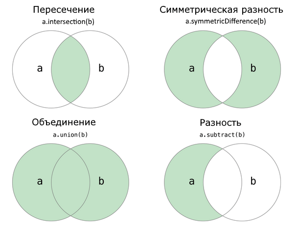  

**1. Объединение**  
Oбъединение множеств состоит из тех и только тех элементов, которые принадлежат *хотя бы одному* из объединяемых множеств  
**2. Пересечение**  
Пересечение множеств состоит из тех и только тех элементов, которые *входят одновременно* в эти множества  
**3. Дополнение**  
Унарная операция нахождения множества всех элементов, *не содержащихся* в данном  
**4. Разность**  
Разность множеств $A$ и $B$ состоит из тех и только тех *элементов множества* $A$ , которые при этом *не входят* в множество $B$  
**5. Симметрическая разность**  
Операция, результатом которой является новое множество, *включающее все элементы исходных множеств*, не принадлежащие *одновременно обоим* исходным множествам  

## 2. Числовые множества. Окрестности.

### Числовые множества:
**Числовые множества** - это *наборы* чисел, объединенных в группы согласно какими-то общим свойствам

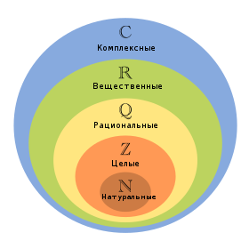

1. Натуральные числа
2. Целые числа
3. Рациональные числа
4. Действительные числа
5. Комплексные числа
   
### Окрестность точки

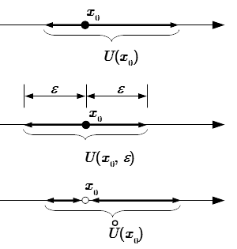  

**Окрестностью действительной точки $x_0$** - любой открытый интервал, содержащий эту точку:  
$U(x_0) =$ { $x: - \varepsilon_1 < x - x_0 < \varepsilon_2 , \space \varepsilon_1 > 0 , \space \varepsilon_2 > 0$ }   
*Здесь* $\varepsilon_1$ *и* $\varepsilon_2$ *- произвольные числа*

**Эпсилон окрестность точки $x_0$** - множество точек, расстояние от которых до точки $x_0$ меньше $\varepsilon$ :  
$U(x_0) =$ { $x: |x-x_0| < \varepsilon$ }   
*ИЛИ*  
**Эпсилон окрестность точки $x_0$** - интервал, содержащий точку $x_0$ так, что:  
$(x_0 - \varepsilon, x_0 + \varepsilon)$  

**Проколотая окрестность точки $x_0$** - окрестность этой точки, из которой исключили саму точку $x_0$:  
$\stackrel{\circ}{U} (x_0) = U(x_0)$ \ { $x_0$ }  
 

## 3. Логические операции и логические символы. Понятие предиката. Необходимое и достаточное условие.

**Логические операции:**
1. Конъюнкция $\land$
2. Дизъюнкция $\lor$
3. Дополнение $\lnot$
4. Импликация $\to$
5. Симметрическая разность $\Delta$

### Предикат
**Предикат** - это утверждение, высказанное о субъекте (однозначно ложное или правдивое).

### Необходимое и достаточное условие
**Необходимое и достаточное условие** - виды условий, логически связанных с некоторым суждением.  
 
***Необходимыми*** условиями правильности утверждения $А$ называются такие условия, без соблюдения которых утверждение $А$ **заведомо не может быть верным**, а ***достаточными*** условиями правильности утверждения $А$ называются условия, при выполнении которых утверждение $А$ **заведомо верно**.  
> **Пример для понимания**  
> Например, необходимым условием делимости целого числа на 2 является то, чтобы число, будучи записано в десятичной системе счисления, не кончалось цифрой 7. Условие это необходимо, но не достаточно, так как, например, число 23 не кончается цифрой 7 и всё-таки не делится на 2. Достаточным условием делимости числа на 2 является то, чтобы оно кончалось цифрой 0. Это условие достаточно, но не необходимо, так как число 38 не кончается цифрой 0 и все-таки делится на 2. Обычно употребляемый признак делимости на 2 (чтобы число делилось на 2, необходимо и достаточно, чтобы последняя его цифра делилась на 2) является примером условия одновременно необходимого и достаточного. Часто выражение «необходимо и достаточно» заменяется выражением «тогда и только тогда» или же выражением «в том и только в том случае».
 

*ПО ОПРЕДЕЛЕНИЮ*  
> $(A \Rightarrow B)$ верно, если выполняется необходимое и достаточное условие:  
Истинность высказывания B является необходимым условием для истинности высказывания A  
(условие, без которого A не может быть истинным).  
Истинность высказывания A является достаточным условием для истинности высказывания B  
(условие, при котором B является истинным).  
 

> [Маргинал объясняет на стакане](https://www.youtube.com/watch?v=tOz9Ji9GEBM)

## 4. Определение функции. Числовые функции. 

### Определение функции
**Функция** – это соответствие между двумя множествами, причем каждому элементу первого множества соответствует один и только один элемент второго множества  
*ИЛИ*  
**Функция** — правило, по которому любому элементу из области определения ставится в соответствие единственный элемент из области значения.  

### Числовые функции
**Основные элементарные функции:**
| Вид | Название | Функция | График |
| - | - | - | - |
| Константа | Константа | $y = const$ | Прямая, параллельная оси Ox |
| Степенная | Кубическая парабола | $y=x^3$ | 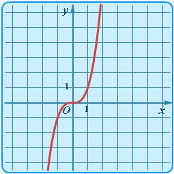  |
| Степенная | Корень | $y = \sqrt{x}$| 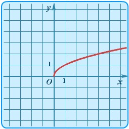 |
| Степенная | Гипербола | $y = k/x$ | 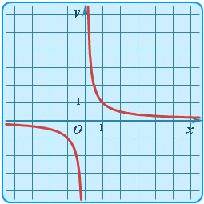 |
| Показательная | Экспонента | $y = e^x$ | 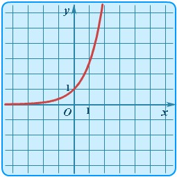 |
| Показательная | Показательной функция a > 1 | $y = a^x$ | 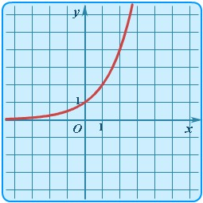 |
| Показательная | Показательной функция 1 > a > 0 | $y = a^x$ | 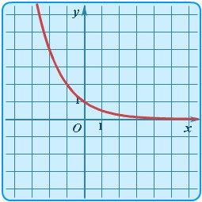 |
| Логарифмическая | Логарифмическая функция a > 1 | $y = log_a x$ | 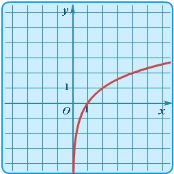 |
| Логарифмическая | Логарифмическая функция 1 > a > 0  | $y = log_a x$ | 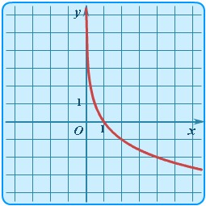 |
| Тригонометрическая | Синус | $y = sin(x)$ | 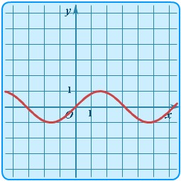 |
| Тригонометрическая | Косинус | $y = cos(x)$ | 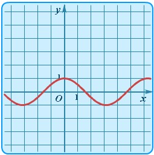 |
| Тригонометрическая | Тангенс | $y = tg(x)$ | 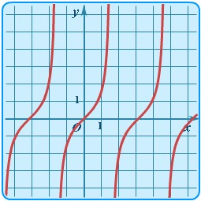 |
| Тригонометрическая | Котангенс | $y = ctg(x)$ |  |
| Обратная тригонометрическия | Арксинус | $y = arcsin(x)$ | 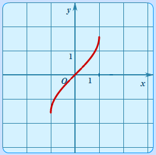 |
| Обратная тригонометрическия | Арккосинус | $y = arccos(x)$ | 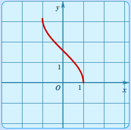 |
| Обратная тригонометрическия | Арктангенс | $y = arctg(x)$ | 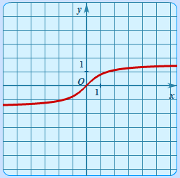 |
| Обратная тригонометрическия | Арккотангенс | $y = arcctg(x)$ | 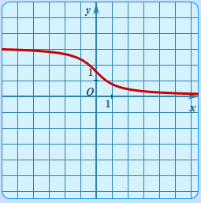 |

**Элементарные функции** - функции, полученные из основных элементарных функций с помощью четырех арифметических действий и операции суперпозиции, примененных конечное число раз.  

*Теорема*
> Каждая элементарная функция *непрерывна* в области своего определения  

**Суперпозиция функций** — это функция, полученная из некоторого множества функций путем *подстановки* одной функции в другую или *отождествления* переменных.  
> [(больше про суперпозицию есть на neerc.ifmo.ru)](http://neerc.ifmo.ru/wiki/index.php?title=%D0%A1%D1%83%D0%BF%D0%B5%D1%80%D0%BF%D0%BE%D0%B7%D0%B8%D1%86%D0%B8%D0%B8)

## 5. Определение предела числовой последовательности. Единственность предела. Переход к пределу в неравенствах. 

### Определение предела числовой последовательнсти

**Числовая последовательность** — последовательность, где каждому натуральному значению n по некоторому правилу поставлено в соответствие действительное число $x_n$.

**Определение предела числовой последовательности** - число $a$ называется пределом последовательности { $x_n$ }, если для любого, сколь угодно малого числа $\varepsilon$ найдется такое положительное число $N_\varepsilon$, что для всех номеров больше $N_\varepsilon$, будет выполнено неравенство $|x_n - a| < \varepsilon$.  
**Запись на $(\varepsilon,\space\delta)$ языке:** $\forall \varepsilon > 0 \space \exists N_\varepsilon \in \mathbb{N} : \forall n > N_\varepsilon \Rightarrow |x_n - a| < \varepsilon$
 
> 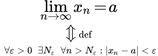  

### Единственность предела

*Теорема:*
> Если предел есть, то он единственный.

*Доказательство:*
> Пусть последовательность { $a_n$ } сходится и у неё есть 2 предела - $x$ и $y$, такие что $x < y$. Тогда:  
> $\forall \varepsilon > 0 \space \exists N_\varepsilon \in \mathbb{N} : \forall n > N_\varepsilon \Rightarrow |a_n - x| < \varepsilon$  
> $\forall \varepsilon > 0 \space \exists N_\varepsilon \in \mathbb{N} : \forall n > N_\varepsilon \Rightarrow |a_n - y| < \varepsilon$  
> Мы возьмем $\varepsilon$ такую, что $\varepsilon$-окрестности $x$ и $y$ не пересекаются. Но тогда члены последовательности с номерами $n > N_\varepsilon\space$ должны собираться в двух непересекающихся окрестностях, что невозможно. Значит, последовательнось не может иметь более одного предела.

### Переход к пределу в неравенствах

*Теорема:*
> Если элементы *сходящейся* последовательности { $x_n$ }, начиная с некоторого номера, удовлетворяют неравенству $x_n \geq b \space (x_n \leq b)$, то и предел a этой последовательности удовлетворяет неравенству $a \geq b \space (a \leq b)$

*Доказательство*
> Пусть все элементы $x_n$, по крайней мере начиная с некоторого номера, удовлетворяют неравенству $x_n \geq b$. Требуется доказать неравенство $a \geq b$. Предположим, что $a < b$. Поскольку $a$ - предел последовательности { $x_n$ }, то для положительного $\epsilon = b - a$ можно указать номер $N$ такой, что при $n \geq N$ выполняется неравенство $|x_n - a| < b - a$. Это неравенство эквивалентно следующим двум неравенствам: $-(b - a) < x_n - a < b - a$. Используя правое из этих неравенств, получим $x_n < b$, а это противоречит условию теоремы. Случай $x_n \leq b$ рассматривается аналогично. 

**!** *Замечание* **!**
> Элементы *сходящейся* последовательности { $x_n$ } могут удовлетворять строгому неравенству $x_n > b$, однако при этом предел $a$ может оказаться равным $b$. Например, если $x_n = \frac{1}{n}$, то $x_n > 0$, однако $\lim\limits_{n \to \infty} x_n = 0$

*Следствие №1*
> Если элементы $x_n$ и $y_n$ сходящихся последовательностей { $x_n$ } и { $y_n$ }, начиная с некоторого номера, удовлетворяют неравенству $x_n \leq y_n$, то их *пределы* удовлетворяют такому же неравенству: $\lim\limits_{n \to \infty} x_n \leq \lim\limits_{n \to \infty} y_n$  
> В самом деле, элементы последовательности { $y_n - x_n$ } *неотрицательны*, а поэтому *неотрицателен и ее предел* $\lim\limits_{n \to \infty} {y_n - x_n} = \lim\limits_{n \to \infty} y_n - \lim\limits_{n \to \infty} x_n$.  
>  Отсюда следует, что $\lim\limits_{n \to \infty} x_n \leq \lim\limits_{n \to \infty} y_n$

*Следствие №2*
> Если *все* элементы сходящейся последовательности { $x_n$ } находятся на сегменте $[a, b]$, то и ее *предел* c также находится на этом сегменте.  
> В самом деле, так как $a \leq x_n \leq b$, то $a \leq c \leq b$.

## 6. Ограниченность сходящихся последовательностей. Бесконечно малые и бесконечно большие последовательности. Арифметические действия над числовыми последовательностями, имеющими предел.

### Ограниченность сходящихся последовательностей

**Числовая последовательность** называется **ограниченной сверху** (снизу), если *множество ее значений ограничено* сверху (снизу)  
Иначе говоря, числовая последовательность { $x_n$ } ограничена сверху (снизу), если существует такое число $c$ принадлежит $\mathbb{R}$ , что для всех номеров $n$ выполняется неравенство $x_n \leq c$ (соответственно неравенство $x_n \geq c$)  

>   

**Последовательность**, ограниченная как сверху, так и снизу, называется **ограниченной**.  
Таким образом, числовая последовательность { $x_n$ } ограничена, если существуют такие числа: $a \in \mathbb{R}$ и $b \in \mathbb{R}$, что для всех номеров $n$ выполняется условие $a \leq x_n \leq b$. Это условие, очевидно, равносильно тому, что существует такое число $c > 0$, что для всех номеров $n$ имеет место неравенство: $|x_n| < c$  

**Последовательность**, не являющаяся ограниченной сверху (снизу), называется **неограниченной сверху** (снизу), а последовательность, не являющаяся ограниченной, называется **неограниченой**  
Примером неограниченных последовательностей являются бесконечно большие последовательности  
Cледует заметить, однако, что не всякая неограниченная последовательность является бесконечно большой. Так, последовательность $x_n = (-1)^n \cdot n + n$ неограниченная, но ***не*** бесконечно большая.

>  **Бесконечно большой последовательностью** называется последовательность, пределом которой является **бесконечность** (со знаком или без знака)  
>  Последовательность $x_n = n^2$ , $n = 1, 2, ...,$ бесконечно большая и $\lim\limits_{n \to \infty} n^2 = + \infty$

*Теорема*  
> Если числовая последовательность имеет ***конечный*** предел, то она ***ограничена***.  

*Доказательство*  
> Пусть последовательность $x_n \in \mathbb{R}$, $n = 1, 2, ...$, имеет *конечный* предел $\lim\limits_{n \to \infty} x_n = a \in \mathbb{R}$.  
> Тогда согласно определению предела последовательности, взяв $\varepsilon = 1$, получим, что существует такой номер $n_1$, что для всех номеров $n > n_1$ будет выполняться неравентсво $|x_n - a| < 1$ (в определении предела последовательности можно взять любое $\varepsilon > 0$; мы взяли $\varepsilon = 1$)  
> 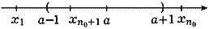  
> Обозначим через $d$ наибольшее из чисел $1$, $|x_1 - a|$, ..., $|x_{n_1} - a|$, . Тогда, очевидно, в силу условия $|x_n - a| < 1$ для всех $n$ принадлежит $\mathbb{N}$ будет иметь место неравенство $|x_n - a| < d$  
> Это и означает, что **последовательность { $x_n$ } ограничена**.

### Бесконечно малые и бесконечно большие последовательности
**Бесконечно большой последовательностью** называется последовательность, пределом которой является **бесконечность** (со знаком или без знака)  
>  Последовательность $x_n = n^2$ , $n = 1, 2, ...,$ бесконечно большая и $\lim\limits_{n \to \infty} n^2 = + \infty$  

**Бесконечно малой последовательностью** называется последовательность, предел которой равен **нулю** (со знаком или без знака)  
> $\lim\limits_{n \to \infty} \frac{n}{n^2 + 1} = \lim\limits_{n \to \infty} \frac{\frac{n}{n^2}}{\frac{n^2 + 1}{n^2}} = \lim\limits_{n \to \infty} \frac{\frac{1}{n}}{1 + \frac{1}{n^2}} = \frac{0}{1 + 0} = 0$  

**Свойства бесконечно малых**
1. Любая конечная линейная комбинация бесконечно малых является бесконечно малой  
2. Произведение бесконечно малой последовательности на ограниченную последовательность является бесконечно малой.  

### Арифметические действия над числовыми последовательностями, имеющими предел
Если последовательности $y_n$ и $x_n$ имеют конечные пределы $\lim\limits x_n = a$ и $\lim\limits y_n = b$, то  

**Сумма (разность) имеет конечный предел**
> $\lim\limits {(x_n \pm y_n)} = a \pm b$

**Произведение имеет конечный предел**
> $\lim\limits {(x_n \cdot u_n)} = a \cdot b$

**Разность имеет конечный предел ( $b \ne 0$ )**
> $\lim\limits {(x_n / y_n)} = a / b$

## 7. Монотонные последовательности. Критерий существования предела монотонных последовательностей. Подпоследовательности. Определение числа “e” (второй замечательный предел).

### Монотонные последовательности

**Убывающие и возрастающие** последовательности называются **монотонными**, а строго убывающие и строго возрастающие - **строго монотонными**  

> Числовая **последовательность** { $x_n$ } называется **возрастающей** (убывающей), если для *всех* $n \in \mathbb{N}$ выполняется неравенство $x_n \leq x_{n+1}$ ( соответственно неравенство $x_n \geq x_{n+1}$)  
> **Возрастающая** (убывающая) последовательность обозначается $x_n \textuparrow$ (соответственно $x_n \textdownarrow$). Если возрастающая (убывающая) последовательность имеет **предел**, равный $a$, то пишут $x_n \textuparrow a$ (соответственно $x_n \textdownarrow a$)  
> Последовательность { $x_n$ } называется **строго возрастающей** (строго убывающей), если для всех $n \in \mathbb{N}$ выполняется неравенство $x_n < x_{n+1}$ (соответственно неравенство $x_n > x_{n+1}$). Строго возрастающая (строго убывающая) последовательность обозначается $x_n \textuparrow \textuparrow$  (соответственно $x_n \textdownarrow \textdownarrow$).  
 
 *Примеры*  
> Последовательность { $1/n$ } строго убывает   
> Последовательность { $n$ } строго возрастает  
> Последовательность { $(-1)^n$ } немонотонная  

### Критерий существования предела монотонных последовательностей

*Теорема (Beйepштpacc)*  
> Всякая возрастающая числовая последовательность { $x_n$ } имеет предел: *конечный*, если она *ограничена* сверху, и *бесконечный*, если она *неограничена* сверху, причем $\lim\limits_{n \to \infty} = \sup$ { $x_n$ }. Аналогично, если { $x_n$ } - убывающая последовательность, то существует (конечный или бесконечный) предел $\lim\limits_{n \to \infty} = \inf$ { $x_n$ } и, следовательно, этот предел *конечен*, если последовательность { $x_n$ } ограничена снизу, и *бесконечен*, если она неограничена снизу  

*Коротко то же самое*  
> Любая монотонная ограниченная последовательность имеет конечный предел, равный точной верхней границе $\sup(x)$ для неубывающей и точной нижней границе $\inf(x)$ для невозрастающей последовательности.  
 

> 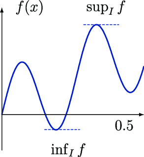  

**Верхняя (нижняя) грань (граница)** множества значений числовой последовательности { $x_n$ } называется верхней (нижней) гранью **этой последовательности** и обозначается $\sup$ { $x_n$ } ( соответственно $\inf$ { $x_n$ })  
Иначе говоря, если $x_n \in \mathbb{R}, n = 1, 2, ...,$ и если $\beta = \sup$ { $x_n$ }, то:  
    1) для всех $n \in \mathbb{N}$ имеет место неравенство $x_n \leq \beta$;  
    2) для любого $\beta' < \beta$ существует такое $n_0 \in \mathbb{N}$, что $x_{n_0} < \beta'$.  
    Аналогично, если $\alpha = \inf$ { $x_n$ }, то:  
    1) для всех $n \in \mathbb{N}$ имеет место неравенство $x_n \geq \alpha$;  
    2) для любого $\alpha' > \alpha$ существует такое $n_0 \in \mathbb{N}$, что $x_{n_0} < \alpha'$.  

### Подпоследовательности

*Более простое определение*  
> **Подпоследовательность данной последовательности** — это последовательность, которая может быть получена из данной последовательности путем удаления некоторых элементов или их отсутствия без изменения порядка остальных элементов

*Строгое математическое определение (принцип компактности)*
> Если дана последовательность { $x_n$ } и из некоторых ее членов $x_{n_k}$, взятых в порядке возрастания номеров $n_k (k > k'$ равносильно $n_k > n_{k'}$ ), составлена новая последовательность { $x_{n_k}$ }, то она называется **подпоследовательностью последовательности** { $x_n$ }.  
    В подпоследовательности { $x_{n_k}$ } $k$ является номером члена *этой* последовательности, а $n_k$ - его номером в *исходной* последовательности. Ясно, что для всех $k = 1, 2, ...$ имеет место неравенство $n_k \geq k$, и поэтому $\lim\limits_{k \to \infty} n_k = + \infty$  
    Подпоследовательности { $x_{n_k}$ } последовательности { $x_n$ } считаются **различными**, если они соответствуют различным наборам номеров { $n_k$ }  

*Теорема*  
> Из любой *ограниченной* числовой последовательности можно выделить **сходящуюся подпоследовательность**, а из любой *неограниченной* сверху (неограниченной снизу) числовой последовательности - **последовательность, имеющую своим пределом** $+ \infty$ ( соответственно $- \infty$).

## 8. Определение предела функции. Бесконечно малые и бесконечно большие функции. Односторонние пределы.

### Определение предела по Коши
**Запись на $(\varepsilon,\space\delta)$ языке:** $\forall \varepsilon > 0 \space \exists \delta > 0: \forall x \space 0 < |x - x_0| < \delta \Rightarrow |f(x) - a| < \varepsilon$  
> Число $a$ называется пределом функции $f(x)$ при $x \rightarrow x_0$, если $\forall \varepsilon$  (где $\varepsilon$ - сколь угодно малое число)  $\exists \delta > 0$ такое, что для всех значений независимой переменной $x$, находящихся в проколотой $\delta$-окрестности точки $x_0$ будет выполнено неравенство $|f(x) - a| < \varepsilon$.
### Определение предела функции по Гейне
>$f(x)$ имеет **предел** $L$ в точке $a$, если для любой **последовательности** { $x_n$ }: $x_n \neq a$, сходящейся к $a:\lim\limits_{n \to \inf} x_n = a$, $\lim\limits_{n \to \inf} f(x_n) = L$. 

**Бесконечно малая**
> Функция $f(x)$ называется бесконечно малой при $x \rightarrow x_0$, если $\lim\limits_{x \rightarrow x_0} f(x) = 0$.  
*Свойства бесконечно малых:* 

1. Произведение бесконечно малой функции $\alpha(x)$ при $x \rightarrow x_0$ и функции $f(x)$, ограниченной в некоторой  $\delta_1$-окрестности точки  a, есть функция бесконечно малая. 
*<b>Доказательство:</b>* 
>Функция  $f(x)$  является ограниченной в некоторой окрестности точки $a$ и, следовательно, существует такое число  $B > 0$,  
что  (1) $|f(x)| < B$ для всех  $x$, удовлетворяющих условию (2) $|x- a| < \delta_1$  
Поскольку функция $\alpha(x)$  является бесконечно малой при  $x \rightarrow a$, то для любого произвольно малого числа  ε > 0 существует такое число  $\delta_2$, что неравенство (3) $| \alpha(x) | < \frac{\varepsilon}{2}$ выполняется для всех  $x$, удовлетворяющих условию (4) $|x-a| < \delta_2$ 
Выберем из чисел  $\delta_1$  и  $\delta_2$  наименьшее и обозначим его символом  $\delta$. Тогда условие (5) $|x-a|< \delta$  
является более сильным, чем условия (2) и (4) и поэтому влечет неравенства (1) и (3). 
Таким образом, для любого произвольно малого числа  $\varepsilon > 0$  выполняется неравенство
для всех  $x$  из  $\delta$-окрестности точки  $a$. 
2.Сумма двух бесконечно малых функций есть функция бесконечно малая. 
*<b>Доказательство:</b>* 
>Пусть  $\varepsilon > 0$  – произвольно малое число;  $\alpha(x)$ и $\beta(x)$ – бесконечно малые функции при $x \rightarrow a$ . Тогда существуют такие положительные числа  $\delta_1$  и $\delta_2$ , что условия (2) и (4) влекут за собой соответствующие неравенства (1) и (3)  
Если  $\delta$ = min( $\delta_1$, $\delta_2$), то условие  (5)  перекрывает оба условия (1) и (3) и, следовательно, 
$|\alpha(x) + \beta(x)| <= |\alpha(x)| + |\beta(x)| < \frac{\varepsilon}{2} + \frac{\varepsilon}{2} = \varepsilon$ 

**Бесконечно большая**
>Функция $f(x)$ называется бесконечно большой при $x \rightarrow x_0$, если $\lim\limits_{x \rightarrow x_0} f(x) = \infty$.

**Односторонний предел**
> Односторонним пределом называется предел, подразумевающий приближение слева $\lim\limits_{x \rightarrow x_0-} f(x)$ или справа $\lim\limits_{x \rightarrow x_0+} f(x)$.

## 9. Локальные свойства функций, имеющих предел. Свойства пределов, связанные с арифметическими операциями. Теорема о сжатой функции. 

!TODO

## 10. Непрерывные функции. Различные определения непрерывности. Свойства функций, непрерывных в точке. Замечательные пределы. 

!TODO

## 11. Сравнение бесконечно малых функций. Порядок малости. Эквивалентные бесконечно малые. 

!TODO

## 12. Свойства функций, непрерывных на отрезке. Теорема Вейерштрасса об ограниченности и достижимости точных граней. Теорема Коши о промежуточных значениях.

!TODO

## 13. Монотонность и непрерывность обратных функций. Классификация точек разрыва.

!TODO

## 14. Вывод табличных производных, пользуясь определением. Дифференцирование функции, пользуясь правилами дифференцирования. Дифференцирование сложных, обратных функций и функций, заданных неявно и параметрически. Использование метода логарифмического дифференцирования. 

!TODO

## 15. Вывод уравнения касательной и нормали к графику функций.

!TODO

## 16. Дифференциал и дифференцируемость функции. Приближённые вычисления с помощью дифференциала.

!TODO

## 17. Французские теоремы. 

!TODO

## 18. Производные и дифференциалы высших порядков.

!TODO

## 19. Правило Лопиталя для вычисления пределов (с выводом).

!TODO

## 20. Разложение функции по формуле Тейлора. Остаточный член в форме Лагранжа. 

!WAIT

## 21. Экстремумы и промежутки возрастания и убывания. Точка перегиба и промежутки выпуклости и вогнутости.

!TODO

## 22. Определение наименьшего и наибольшего значений функции на промежутке. Асимптоты графика функции. Проведение полного исследования функции и построение их графиков.

!TODO

## 23. Область. Замкнутая область. Понятие функции двух переменных. Геометрический смысл. Предел функции двух переменных.

!WAIT

## 24. Частные производные первого и второго порядка, их свойства.

!TODO

## 25. Нахождение экстремума функции двух переменных.

!WAIT

## 26. Условный экстремум.

!WAIT

## 27. Полный дифференциал функции двух переменных. Его применение к приближённым вычислениям.

!WAIT

## 28. Дифференциалы высших порядков и формула Тейлора для функции двух переменных.

!WAIT

## 29. Уравнение касательной плоскости и нормали к поверхности. Односторонние и двухсторонние поверхности.

!TODO

## 30. Скалярное поле, градиент, производная по направлению.

!WAIT

## 31. Комплексные числа: арифметические действия с комплексными числами в алгебраической и тригонометрической формах. Геометрическая трактовка комплексных чисел. Задание областей на комплексной плоскости.

!TODO
